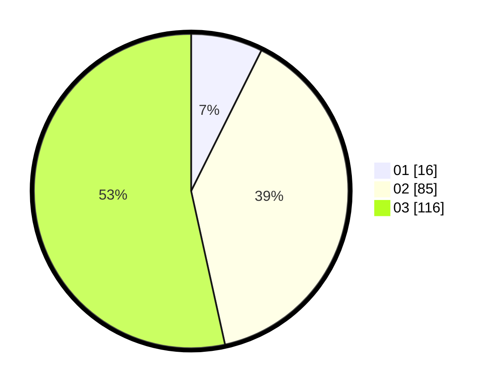

# Hasil

Hasil perolehan suara paslon dapat dilihat pada file paslon-01.txt, paslon-02.txt, dan paslon-03.txt.

Jika tidak ada, artinya data tersebut belum ada pada SIREKAP.

## Perolehan Suara

 * Paslon 01: **16**.
 * Paslon 02: **85**.
 * Paslon 03: **116**.

## Foto C Plano

https://sirekap-obj-formc.kpu.go.id/dc8a/pemilu/ppwp/31/73/08/10/02/3173081002096-20240214-211541--9eddcc6c-ef33-4dcd-aab3-e8645409c8eb.jpg

https://sirekap-obj-formc.kpu.go.id/dc8a/pemilu/ppwp/31/73/08/10/02/3173081002096-20240214-211552--a208c65b-eb51-4064-b28e-e5b03ed137a6.jpg

https://sirekap-obj-formc.kpu.go.id/dc8a/pemilu/ppwp/31/73/08/10/02/3173081002096-20240214-211558--4e724235-e418-4f70-8c86-d5e553b68644.jpg
