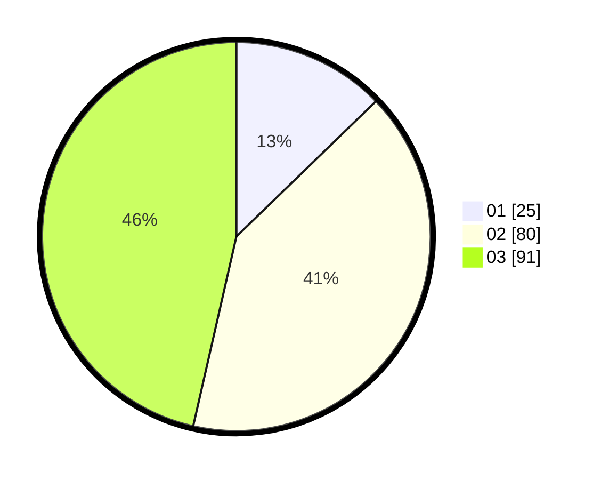

# Hasil

Hasil perolehan suara paslon dapat dilihat pada file paslon-01.txt, paslon-02.txt, dan paslon-03.txt.

Jika tidak ada, artinya data tersebut belum ada pada SIREKAP.

## Perolehan Suara

 * Paslon 01: **25**.
 * Paslon 02: **80**.
 * Paslon 03: **91**.

## Foto C Plano

https://sirekap-obj-formc.kpu.go.id/8eb6/pemilu/ppwp/31/73/08/10/02/3173081002098-20240214-201351--41d70424-0ec7-4d71-a8df-6f2147f52f71.jpg

https://sirekap-obj-formc.kpu.go.id/8eb6/pemilu/ppwp/31/73/08/10/02/3173081002098-20240216-134843--c64b1480-e30c-4b5c-9523-713482f4f6e5.jpg

https://sirekap-obj-formc.kpu.go.id/8eb6/pemilu/ppwp/31/73/08/10/02/3173081002098-20240216-134842--fd80a6ac-e62c-4f7b-ae6c-5318672ae001.jpg

## DATA PEMILIH TETAP

Jumlah pemilih dalam DPT: **233**.
 * L: **108**.
 * P: **125**.

## DATA PENGGUNA HAK PILIH

Jumlah pengguna hak pilih dalam DPT: **193**.
 * L: **99**.
 * P: **94**.

Jumlah pengguna hak pilih dalam DPTb: **6**.
 * L: **4**.
 * P: **2**.

Jumlah pengguna hak pilih dalam DPK: **4**.
 * L: **2**.
 * P: **2**.

Jumlah pengguna hak pilih: **203**.
 * L: **105**.
 * P: **98**.

## JUMLAH SUARA SAH DAN TIDAK SAH

JUMLAH SELURUH SUARA SAH: **196**.

JUMLAH SUARA TIDAK SAH: **1**.

JUMLAH SELURUH SUARA SAH DAN SUARA TIDAK SAH: **197**.
