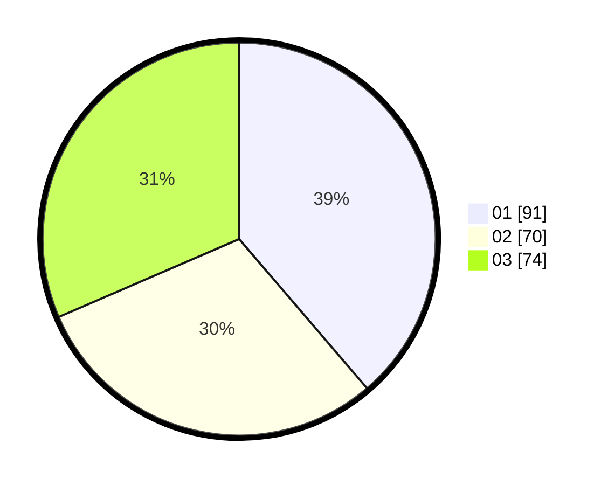

# Hasil

Hasil perolehan suara paslon dapat dilihat pada file paslon-01.txt, paslon-02.txt, dan paslon-03.txt.

Jika tidak ada, artinya data tersebut belum ada pada SIREKAP.

## Perolehan Suara

 * Paslon 01: **91**.
 * Paslon 02: **70**.
 * Paslon 03: **74**.

## Foto C Plano

https://sirekap-obj-formc.kpu.go.id/6a59/pemilu/ppwp/31/73/08/10/02/3173081002104-20240214-215302--3c191ea1-45d4-40ae-9c82-d81dbf8ca632.jpg

https://sirekap-obj-formc.kpu.go.id/6a59/pemilu/ppwp/31/73/08/10/02/3173081002104-20240214-215405--1ab05283-bcb1-414b-aed0-771db0760fda.jpg

https://sirekap-obj-formc.kpu.go.id/6a59/pemilu/ppwp/31/73/08/10/02/3173081002104-20240214-215511--119ae1d7-9fda-4ae5-ab61-46d18b128175.jpg
