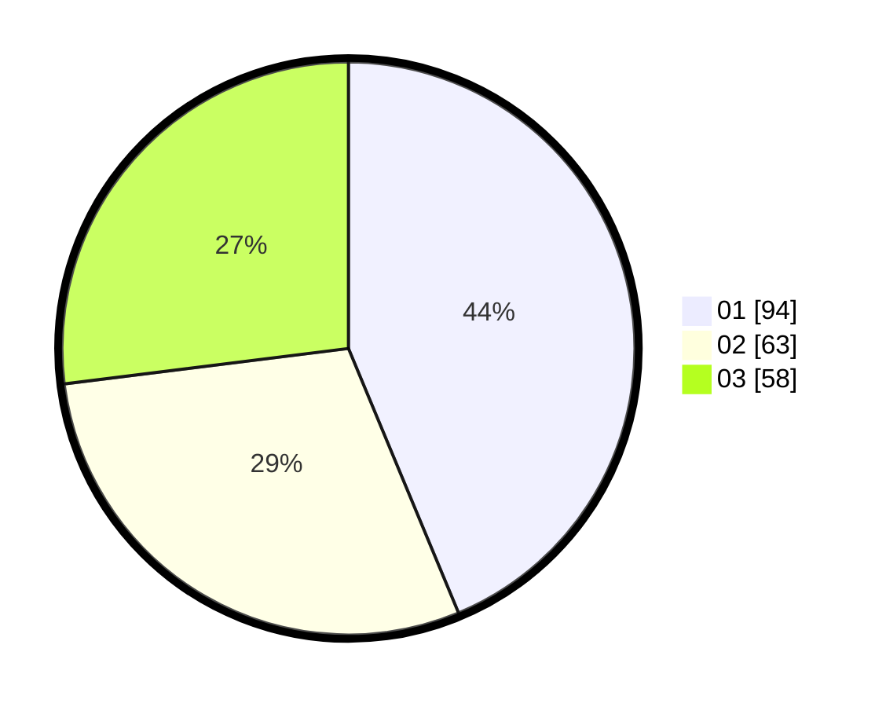

# Hasil

Hasil perolehan suara paslon dapat dilihat pada file paslon-01.txt, paslon-02.txt, dan paslon-03.txt.

Jika tidak ada, artinya data tersebut belum ada pada SIREKAP.

## Perolehan Suara

 * Paslon 01: **94**.
 * Paslon 02: **63**.
 * Paslon 03: **58**.

## Foto C Plano

https://sirekap-obj-formc.kpu.go.id/55dd/pemilu/ppwp/31/73/08/10/02/3173081002106-20240216-015554--19016e78-6a4b-4ed9-976c-4f8d35609390.jpg

https://sirekap-obj-formc.kpu.go.id/55dd/pemilu/ppwp/31/73/08/10/02/3173081002106-20240215-203031--e9ffd87d-b675-4c7a-a5bd-9b38724058b1.jpg

https://sirekap-obj-formc.kpu.go.id/55dd/pemilu/ppwp/31/73/08/10/02/3173081002106-20240215-203029--b4ff066b-9ebc-4da4-8d7b-89ea3bc0ada6.jpg

## DATA PEMILIH TETAP

Jumlah pemilih dalam DPT: **277**.
 * L: **138**.
 * P: **139**.

## DATA PENGGUNA HAK PILIH

Jumlah pengguna hak pilih dalam DPT: **212**.
 * L: **107**.
 * P: **105**.

Jumlah pengguna hak pilih dalam DPTb: **3**.
 * L: **1**.
 * P: **2**.

Jumlah pengguna hak pilih dalam DPK: **4**.
 * L: **2**.
 * P: **2**.

Jumlah pengguna hak pilih: **219**.
 * L: **110**.
 * P: **109**.

## JUMLAH SUARA SAH DAN TIDAK SAH

JUMLAH SELURUH SUARA SAH: **215**.

JUMLAH SUARA TIDAK SAH: **4**.

JUMLAH SELURUH SUARA SAH DAN SUARA TIDAK SAH: **219**.
