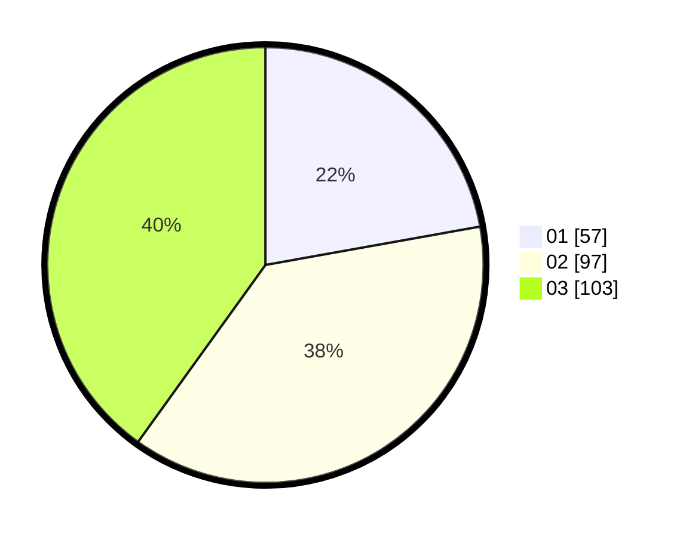

# Hasil

Hasil perolehan suara paslon dapat dilihat pada file paslon-01.txt, paslon-02.txt, dan paslon-03.txt.

Jika tidak ada, artinya data tersebut belum ada pada SIREKAP.

## Perolehan Suara

 * Paslon 01: **57**.
 * Paslon 02: **97**.
 * Paslon 03: **103**.

## Foto C Plano

https://sirekap-obj-formc.kpu.go.id/d89e/pemilu/ppwp/31/73/08/10/02/3173081002108-20240215-134524--c40696cf-f2da-42e2-9316-85118157b70f.jpg

https://sirekap-obj-formc.kpu.go.id/d89e/pemilu/ppwp/31/73/08/10/02/3173081002108-20240215-004139--39d7c631-dba5-4ce8-bf8c-a0331d078a2a.jpg

https://sirekap-obj-formc.kpu.go.id/d89e/pemilu/ppwp/31/73/08/10/02/3173081002108-20240215-134804--01911619-9a08-4352-a3ae-f5e958a382c2.jpg
