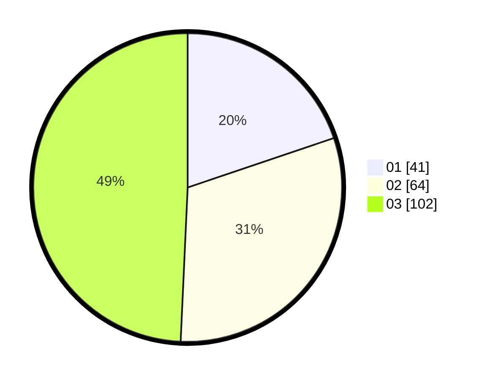

# Hasil

Hasil perolehan suara paslon dapat dilihat pada file paslon-01.txt, paslon-02.txt, dan paslon-03.txt.

Jika tidak ada, artinya data tersebut belum ada pada SIREKAP.

## Perolehan Suara

 * Paslon 01: **41**.
 * Paslon 02: **64**.
 * Paslon 03: **102**.

## Foto C Plano

https://sirekap-obj-formc.kpu.go.id/3ce5/pemilu/ppwp/31/73/08/10/02/3173081002109-20240214-212623--dc68d2bf-e11b-43a4-a684-5460b7dba87c.jpg

https://sirekap-obj-formc.kpu.go.id/3ce5/pemilu/ppwp/31/73/08/10/02/3173081002109-20240214-211007--a3abca5f-7480-4ae5-a831-315bb66f6487.jpg

https://sirekap-obj-formc.kpu.go.id/3ce5/pemilu/ppwp/31/73/08/10/02/3173081002109-20240214-211228--eff2d499-a1f3-4adb-84d8-6efb35b49613.jpg
