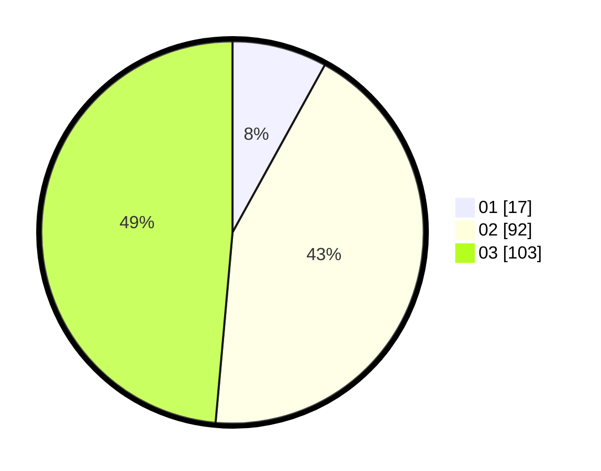

# Hasil

Hasil perolehan suara paslon dapat dilihat pada file paslon-01.txt, paslon-02.txt, dan paslon-03.txt.

Jika tidak ada, artinya data tersebut belum ada pada SIREKAP.

## Perolehan Suara

 * Paslon 01: **17**.
 * Paslon 02: **92**.
 * Paslon 03: **103**.

## Foto C Plano

https://sirekap-obj-formc.kpu.go.id/eeb8/pemilu/ppwp/31/73/08/10/02/3173081002116-20240214-205846--ff84afd9-2a68-4fbd-a3f3-8ef54dd235e1.jpg

https://sirekap-obj-formc.kpu.go.id/eeb8/pemilu/ppwp/31/73/08/10/02/3173081002116-20240214-205856--a80bad37-3f4f-41e0-ac77-e2ca52f9a419.jpg

https://sirekap-obj-formc.kpu.go.id/eeb8/pemilu/ppwp/31/73/08/10/02/3173081002116-20240214-205901--3a96f393-6819-4e12-92cb-0d1c89749aa3.jpg
