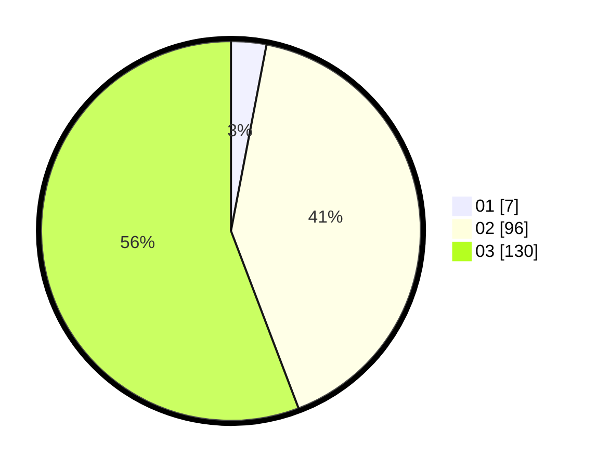

# Hasil

Hasil perolehan suara paslon dapat dilihat pada file paslon-01.txt, paslon-02.txt, dan paslon-03.txt.

Jika tidak ada, artinya data tersebut belum ada pada SIREKAP.

## Perolehan Suara

 * Paslon 01: **7**.
 * Paslon 02: **96**.
 * Paslon 03: **130**.

## Foto C Plano

https://sirekap-obj-formc.kpu.go.id/6374/pemilu/ppwp/31/73/08/10/02/3173081002117-20240214-204005--f29c4f57-3302-4ceb-884e-7852dbf2e273.jpg

https://sirekap-obj-formc.kpu.go.id/6374/pemilu/ppwp/31/73/08/10/02/3173081002117-20240214-204018--69784c9b-a5bd-4813-a559-f6a4d3ba4277.jpg

https://sirekap-obj-formc.kpu.go.id/6374/pemilu/ppwp/31/73/08/10/02/3173081002117-20240214-203953--387baaaf-ccca-40fa-97f1-48650baa08af.jpg
