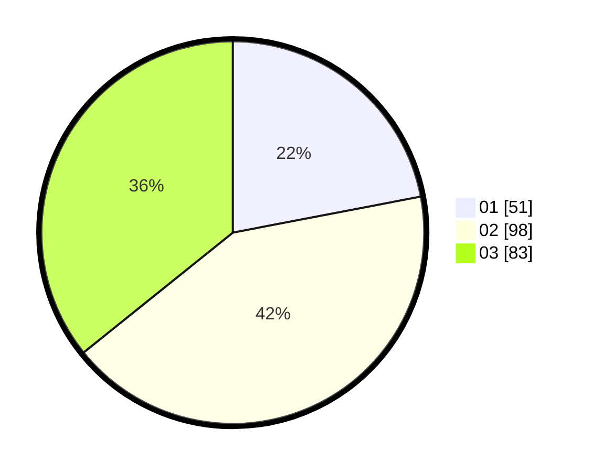

# Hasil

Hasil perolehan suara paslon dapat dilihat pada file paslon-01.txt, paslon-02.txt, dan paslon-03.txt.

Jika tidak ada, artinya data tersebut belum ada pada SIREKAP.

## Perolehan Suara

 * Paslon 01: **51**.
 * Paslon 02: **98**.
 * Paslon 03: **83**.

## Foto C Plano

https://sirekap-obj-formc.kpu.go.id/6909/pemilu/ppwp/31/73/08/10/02/3173081002124-20240215-211306--6ee0ac1d-253c-440d-bd95-939854374743.jpg

https://sirekap-obj-formc.kpu.go.id/6909/pemilu/ppwp/31/73/08/10/02/3173081002124-20240215-211308--e827f0a6-c8f2-4b77-9638-5ab9be8e37d3.jpg

https://sirekap-obj-formc.kpu.go.id/6909/pemilu/ppwp/31/73/08/10/02/3173081002124-20240215-211307--0e0ba2e2-2720-4849-918a-46264c14d661.jpg

## DATA PEMILIH TETAP

Jumlah pemilih dalam DPT: **270**.
 * L: **122**.
 * P: **148**.

## DATA PENGGUNA HAK PILIH

Jumlah pengguna hak pilih dalam DPT: **221**.
 * L: **105**.
 * P: **116**.

Jumlah pengguna hak pilih dalam DPTb: **12**.
 * L: **9**.
 * P: **3**.

Jumlah pengguna hak pilih dalam DPK: **1**.
 * L: **0**.
 * P: **1**.

Jumlah pengguna hak pilih: **234**.
 * L: **114**.
 * P: **120**.

## JUMLAH SUARA SAH DAN TIDAK SAH

JUMLAH SELURUH SUARA SAH: **232**.

JUMLAH SUARA TIDAK SAH: **2**.

JUMLAH SELURUH SUARA SAH DAN SUARA TIDAK SAH: **234**.
