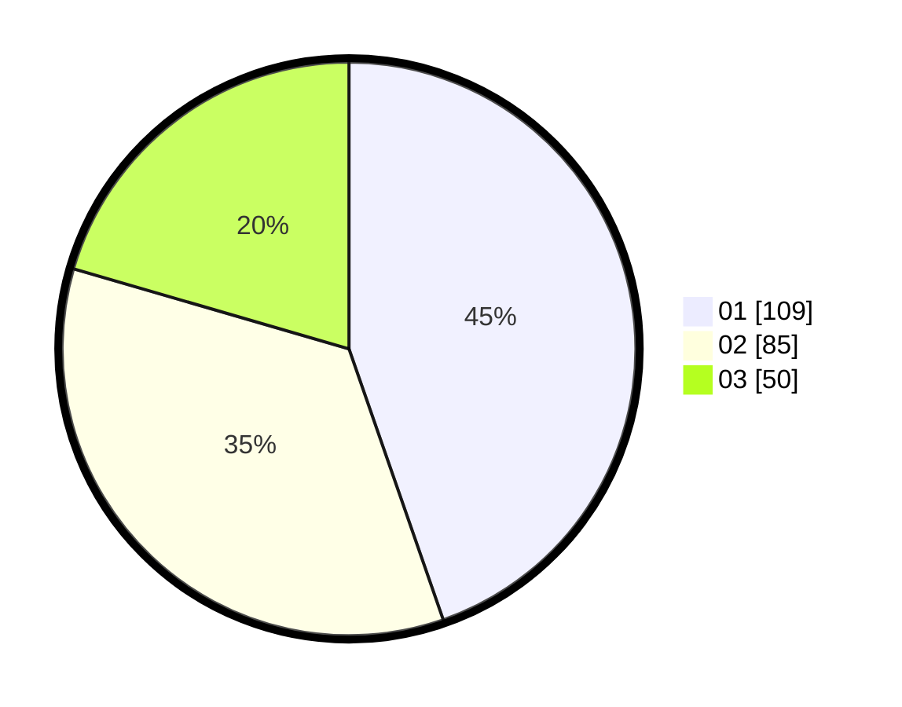

# Hasil

Hasil perolehan suara paslon dapat dilihat pada file paslon-01.txt, paslon-02.txt, dan paslon-03.txt.

Jika tidak ada, artinya data tersebut belum ada pada SIREKAP.

## Perolehan Suara

 * Paslon 01: **109**.
 * Paslon 02: **85**.
 * Paslon 03: **50**.

## Foto C Plano

https://sirekap-obj-formc.kpu.go.id/4e19/pemilu/ppwp/31/73/08/10/02/3173081002126-20240214-220852--884e023a-db3a-4048-850f-9376e63e1d7a.jpg

https://sirekap-obj-formc.kpu.go.id/4e19/pemilu/ppwp/31/73/08/10/02/3173081002126-20240214-220937--f8f414f4-ff6e-4559-95de-2fd0fe452aa2.jpg

https://sirekap-obj-formc.kpu.go.id/4e19/pemilu/ppwp/31/73/08/10/02/3173081002126-20240214-221037--4a01b8ef-4dfe-46bd-8b99-7797b1c19ba3.jpg

## DATA PEMILIH TETAP

Jumlah pemilih dalam DPT: **237**.
 * L: **124**.
 * P: **113**.

## DATA PENGGUNA HAK PILIH

Jumlah pengguna hak pilih dalam DPT: **237**.
 * L: **524**.
 * P: **633**.

Jumlah pengguna hak pilih dalam DPTb: **5**.
 * L: **3**.
 * P: **2**.

Jumlah pengguna hak pilih dalam DPK: **4**.
 * L: **2**.
 * P: **2**.

Jumlah pengguna hak pilih: **246**.
 * L: **504**.
 * P: **27**.

## JUMLAH SUARA SAH DAN TIDAK SAH

JUMLAH SELURUH SUARA SAH: **244**.

JUMLAH SUARA TIDAK SAH: **2**.

JUMLAH SELURUH SUARA SAH DAN SUARA TIDAK SAH: **246**.
