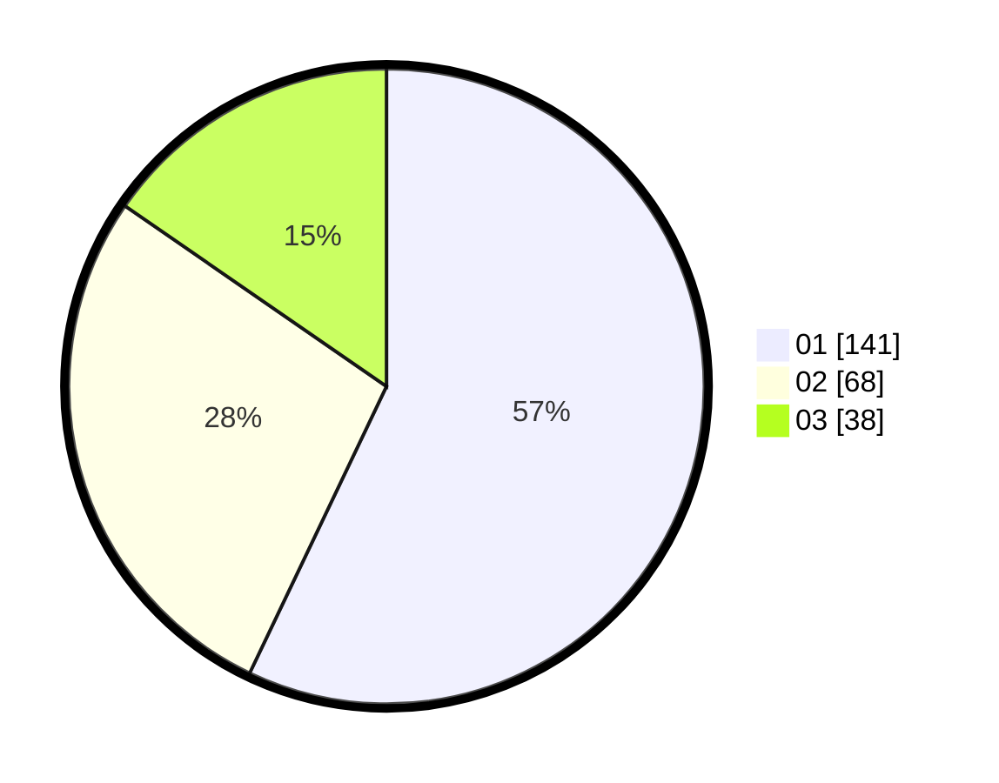

# Hasil

Hasil perolehan suara paslon dapat dilihat pada file paslon-01.txt, paslon-02.txt, dan paslon-03.txt.

Jika tidak ada, artinya data tersebut belum ada pada SIREKAP.

## Perolehan Suara

 * Paslon 01: **141**.
 * Paslon 02: **68**.
 * Paslon 03: **38**.

## Foto C Plano

https://sirekap-obj-formc.kpu.go.id/b28d/pemilu/ppwp/31/73/08/10/02/3173081002130-20240216-003332--257c35ea-4107-4388-9688-9837845bae58.jpg

https://sirekap-obj-formc.kpu.go.id/b28d/pemilu/ppwp/31/73/08/10/02/3173081002130-20240216-003337--0a615b54-578d-491f-a98d-96dd66a15977.jpg

https://sirekap-obj-formc.kpu.go.id/b28d/pemilu/ppwp/31/73/08/10/02/3173081002130-20240216-003335--b1b0e7a6-769c-4463-ae14-0ec0b3c7cc3c.jpg

## DATA PEMILIH TETAP

Jumlah pemilih dalam DPT: **249**.
 * L: **126**.
 * P: **123**.

## DATA PENGGUNA HAK PILIH

Jumlah pengguna hak pilih dalam DPT: **299**.
 * L: **148**.
 * P: **151**.

Jumlah pengguna hak pilih dalam DPTb: **0**.
 * L: **0**.
 * P: **0**.

Jumlah pengguna hak pilih dalam DPK: **0**.
 * L: **0**.
 * P: **0**.

Jumlah pengguna hak pilih: **299**.
 * L: **148**.
 * P: **151**.

## JUMLAH SUARA SAH DAN TIDAK SAH

JUMLAH SELURUH SUARA SAH: **247**.

JUMLAH SUARA TIDAK SAH: **2**.

JUMLAH SELURUH SUARA SAH DAN SUARA TIDAK SAH: **249**.
