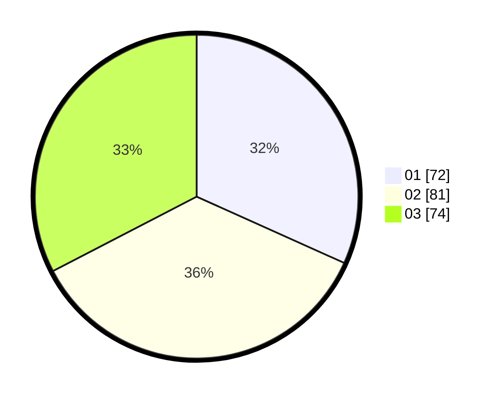

# Hasil

Hasil perolehan suara paslon dapat dilihat pada file paslon-01.txt, paslon-02.txt, dan paslon-03.txt.

Jika tidak ada, artinya data tersebut belum ada pada SIREKAP.

## Perolehan Suara

 * Paslon 01: **72**.
 * Paslon 02: **81**.
 * Paslon 03: **74**.

## Foto C Plano

https://sirekap-obj-formc.kpu.go.id/84c9/pemilu/ppwp/31/73/08/10/02/3173081002132-20240214-215246--b29fb801-8f79-4d76-9b81-04886232cfa8.jpg

https://sirekap-obj-formc.kpu.go.id/84c9/pemilu/ppwp/31/73/08/10/02/3173081002132-20240214-215401--ba26e34e-7da3-4f1e-ba80-6206ea5e3249.jpg

https://sirekap-obj-formc.kpu.go.id/84c9/pemilu/ppwp/31/73/08/10/02/3173081002132-20240214-215450--f39f61ff-9870-4239-b2a2-81e3d470108a.jpg
