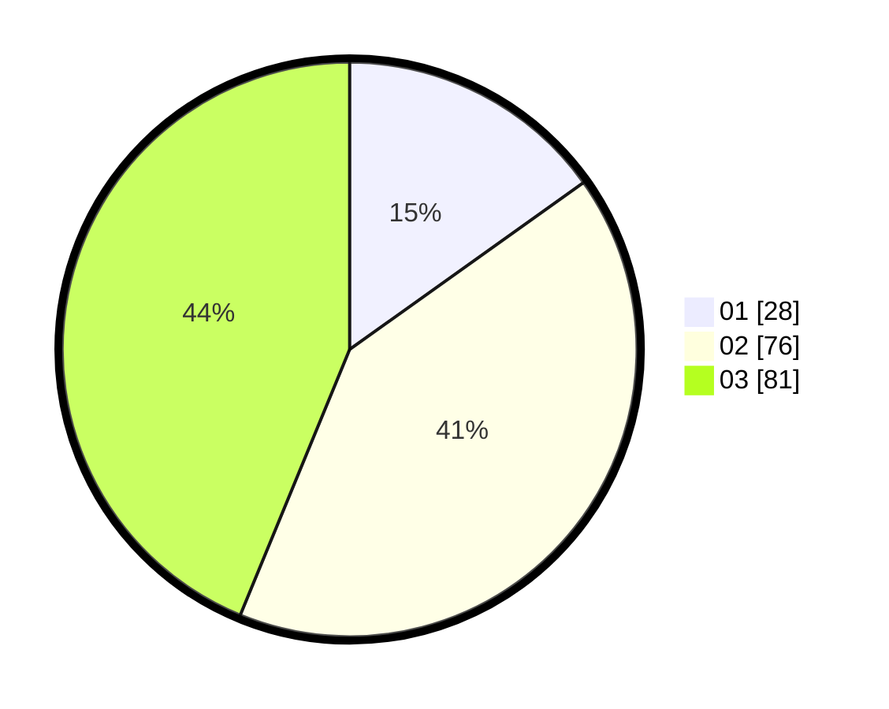

# Hasil

Hasil perolehan suara paslon dapat dilihat pada file paslon-01.txt, paslon-02.txt, dan paslon-03.txt.

Jika tidak ada, artinya data tersebut belum ada pada SIREKAP.

## Perolehan Suara

 * Paslon 01: **28**.
 * Paslon 02: **76**.
 * Paslon 03: **81**.

## Foto C Plano

https://sirekap-obj-formc.kpu.go.id/467d/pemilu/ppwp/31/73/08/10/02/3173081002133-20240216-142706--9b12fef0-e6e5-41b5-9cc7-64b31036f22c.jpg

https://sirekap-obj-formc.kpu.go.id/467d/pemilu/ppwp/31/73/08/10/02/3173081002133-20240216-142707--3d67aa55-821a-44ca-979f-25f583fa5154.jpg

https://sirekap-obj-formc.kpu.go.id/467d/pemilu/ppwp/31/73/08/10/02/3173081002133-20240216-142706--8b3b7c73-c49d-4b59-b0de-3eb265b99378.jpg

## DATA PEMILIH TETAP

Jumlah pemilih dalam DPT: **229**.
 * L: **107**.
 * P: **122**.

## DATA PENGGUNA HAK PILIH

Jumlah pengguna hak pilih dalam DPT: **176**.
 * L: **84**.
 * P: **92**.

Jumlah pengguna hak pilih dalam DPTb: **2**.
 * L: **0**.
 * P: **2**.

Jumlah pengguna hak pilih dalam DPK: **7**.
 * L: **3**.
 * P: **4**.

Jumlah pengguna hak pilih: **185**.
 * L: **87**.
 * P: **98**.

## JUMLAH SUARA SAH DAN TIDAK SAH

JUMLAH SELURUH SUARA SAH: **185**.

JUMLAH SUARA TIDAK SAH: **0**.

JUMLAH SELURUH SUARA SAH DAN SUARA TIDAK SAH: **185**.
