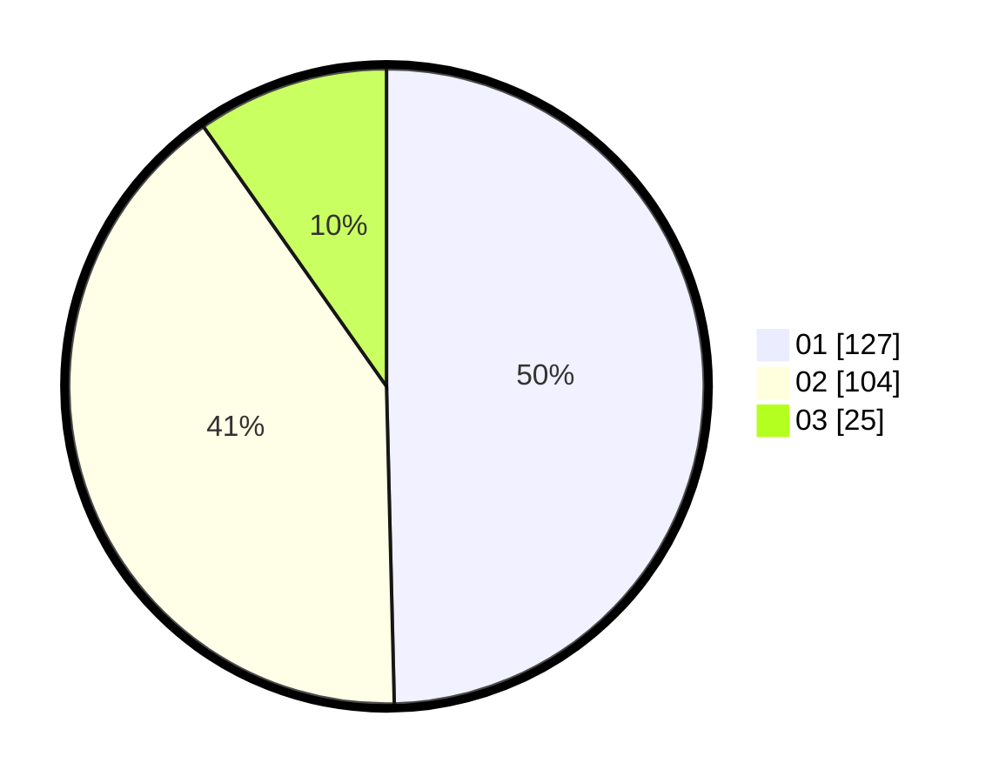

# Hasil

Hasil perolehan suara paslon dapat dilihat pada file paslon-01.txt, paslon-02.txt, dan paslon-03.txt.

Jika tidak ada, artinya data tersebut belum ada pada SIREKAP.

## Perolehan Suara

 * Paslon 01: **127**.
 * Paslon 02: **104**.
 * Paslon 03: **25**.

## Foto C Plano

https://sirekap-obj-formc.kpu.go.id/09dc/pemilu/ppwp/31/73/08/10/02/3173081002136-20240215-033715--1b1bdf19-3394-4c16-bb10-a3fdf17cb03e.jpg

https://sirekap-obj-formc.kpu.go.id/09dc/pemilu/ppwp/31/73/08/10/02/3173081002136-20240215-033812--e292ab15-0808-444d-98b0-e84178b00510.jpg

https://sirekap-obj-formc.kpu.go.id/09dc/pemilu/ppwp/31/73/08/10/02/3173081002136-20240215-033941--e1b16742-5b9d-4fd6-ac34-1388a301ed87.jpg
