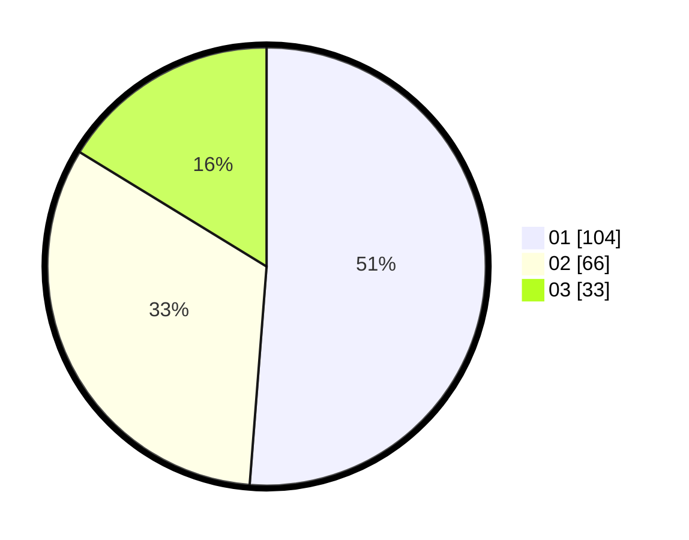

# Hasil

Hasil perolehan suara paslon dapat dilihat pada file paslon-01.txt, paslon-02.txt, dan paslon-03.txt.

Jika tidak ada, artinya data tersebut belum ada pada SIREKAP.

## Perolehan Suara

 * Paslon 01: **104**.
 * Paslon 02: **66**.
 * Paslon 03: **33**.

## Foto C Plano

https://sirekap-obj-formc.kpu.go.id/81c0/pemilu/ppwp/31/73/08/10/02/3173081002138-20240214-204225--deac6f9e-ebd7-4c93-8b90-4a9f8dcd7d67.jpg

https://sirekap-obj-formc.kpu.go.id/81c0/pemilu/ppwp/31/73/08/10/02/3173081002138-20240214-200507--b9630c3e-9b01-44f7-a650-a20ac728208f.jpg

https://sirekap-obj-formc.kpu.go.id/81c0/pemilu/ppwp/31/73/08/10/02/3173081002138-20240214-201143--44fbb5f3-fbc5-4d08-9f1b-aeaf26a8ac35.jpg

## DATA PEMILIH TETAP

Jumlah pemilih dalam DPT: **272**.
 * L: **134**.
 * P: **138**.

## DATA PENGGUNA HAK PILIH

Jumlah pengguna hak pilih dalam DPT: **204**.
 * L: **103**.
 * P: **101**.

Jumlah pengguna hak pilih dalam DPTb: **0**.
 * L: **0**.
 * P: **0**.

Jumlah pengguna hak pilih dalam DPK: **1**.
 * L: **1**.
 * P: **0**.

Jumlah pengguna hak pilih: **205**.
 * L: **104**.
 * P: **101**.

## JUMLAH SUARA SAH DAN TIDAK SAH

JUMLAH SELURUH SUARA SAH: **203**.

JUMLAH SUARA TIDAK SAH: **2**.

JUMLAH SELURUH SUARA SAH DAN SUARA TIDAK SAH: **205**.
