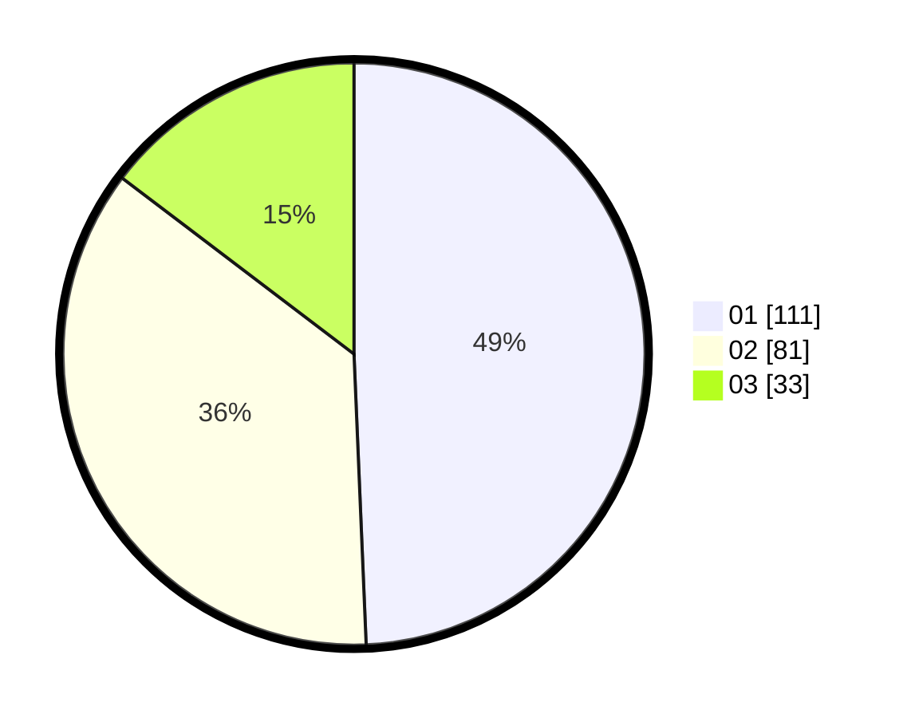

# Hasil

Hasil perolehan suara paslon dapat dilihat pada file paslon-01.txt, paslon-02.txt, dan paslon-03.txt.

Jika tidak ada, artinya data tersebut belum ada pada SIREKAP.

## Perolehan Suara

 * Paslon 01: **111**.
 * Paslon 02: **81**.
 * Paslon 03: **33**.

## Foto C Plano

https://sirekap-obj-formc.kpu.go.id/40d5/pemilu/ppwp/31/73/08/10/02/3173081002139-20240216-001320--02747812-bab1-4624-86ea-7981db7c0c3d.jpg

https://sirekap-obj-formc.kpu.go.id/40d5/pemilu/ppwp/31/73/08/10/02/3173081002139-20240216-001322--799acb88-96ac-41c0-8dd6-2479e84af6a1.jpg

https://sirekap-obj-formc.kpu.go.id/40d5/pemilu/ppwp/31/73/08/10/02/3173081002139-20240216-001321--6ecaf3ac-6ec6-430d-8fb8-fbd36ed2ab71.jpg

## DATA PEMILIH TETAP

Jumlah pemilih dalam DPT: **268**.
 * L: **137**.
 * P: **131**.

## DATA PENGGUNA HAK PILIH

Jumlah pengguna hak pilih dalam DPT: **222**.
 * L: **111**.
 * P: **111**.

Jumlah pengguna hak pilih dalam DPTb: **2**.
 * L: **1**.
 * P: **1**.

Jumlah pengguna hak pilih dalam DPK: **1**.
 * L: **0**.
 * P: **1**.

Jumlah pengguna hak pilih: **225**.
 * L: **112**.
 * P: **113**.

## JUMLAH SUARA SAH DAN TIDAK SAH

JUMLAH SELURUH SUARA SAH: **225**.

JUMLAH SUARA TIDAK SAH: **0**.

JUMLAH SELURUH SUARA SAH DAN SUARA TIDAK SAH: **225**.
