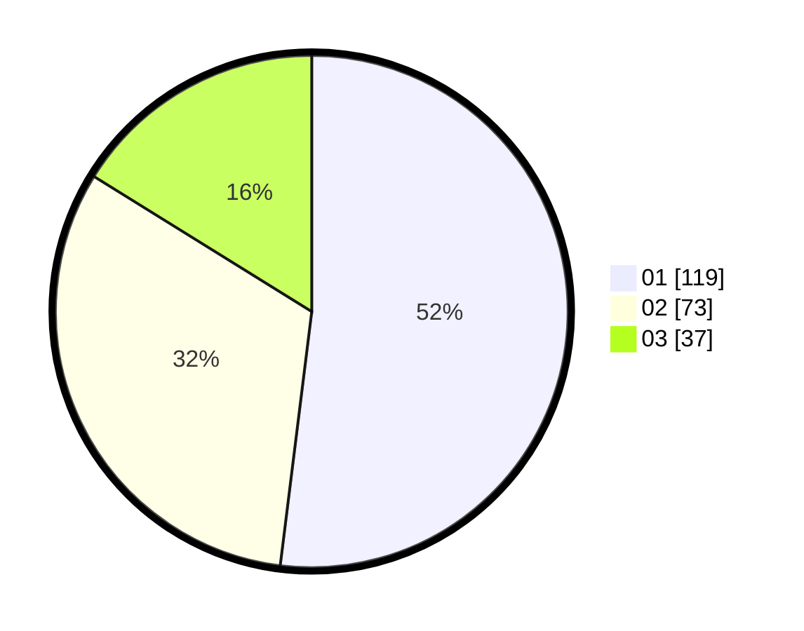

# Hasil

Hasil perolehan suara paslon dapat dilihat pada file paslon-01.txt, paslon-02.txt, dan paslon-03.txt.

Jika tidak ada, artinya data tersebut belum ada pada SIREKAP.

## Perolehan Suara

 * Paslon 01: **119**.
 * Paslon 02: **73**.
 * Paslon 03: **37**.

## Foto C Plano

https://sirekap-obj-formc.kpu.go.id/a515/pemilu/ppwp/31/73/08/10/02/3173081002146-20240215-000307--c418799f-12be-49b9-b887-be4548a32e01.jpg

https://sirekap-obj-formc.kpu.go.id/a515/pemilu/ppwp/31/73/08/10/02/3173081002146-20240215-000445--e8e7ceff-6c1a-4b1c-9466-c5a484a7cb44.jpg

https://sirekap-obj-formc.kpu.go.id/a515/pemilu/ppwp/31/73/08/10/02/3173081002146-20240215-000505--b3470138-a8cc-4ad3-9752-7fae9e9cb02f.jpg
