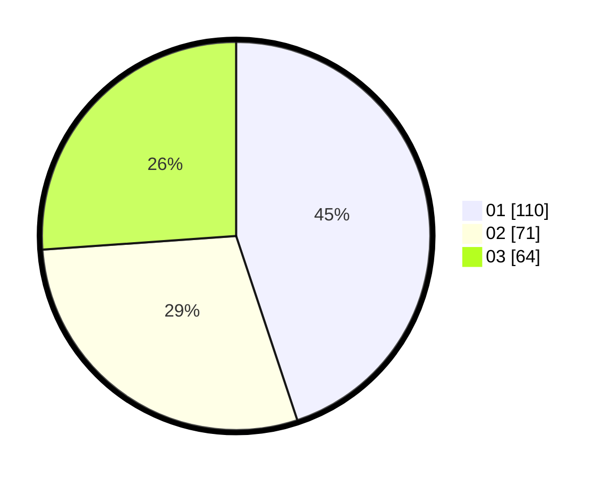

# Hasil

Hasil perolehan suara paslon dapat dilihat pada file paslon-01.txt, paslon-02.txt, dan paslon-03.txt.

Jika tidak ada, artinya data tersebut belum ada pada SIREKAP.

## Perolehan Suara

 * Paslon 01: **110**.
 * Paslon 02: **71**.
 * Paslon 03: **64**.

## Foto C Plano

https://sirekap-obj-formc.kpu.go.id/3547/pemilu/ppwp/31/73/08/10/03/3173081003010-20240214-200142--8279e1da-096f-4dce-984c-8fec33f74cd5.jpg

https://sirekap-obj-formc.kpu.go.id/3547/pemilu/ppwp/31/73/08/10/03/3173081003010-20240214-200236--504e8ebb-f154-48d8-ab1e-50abf9e76a8c.jpg

https://sirekap-obj-formc.kpu.go.id/3547/pemilu/ppwp/31/73/08/10/03/3173081003010-20240214-192327--ee7d506e-ddfd-4df5-9fc3-b20dad4aae60.jpg
