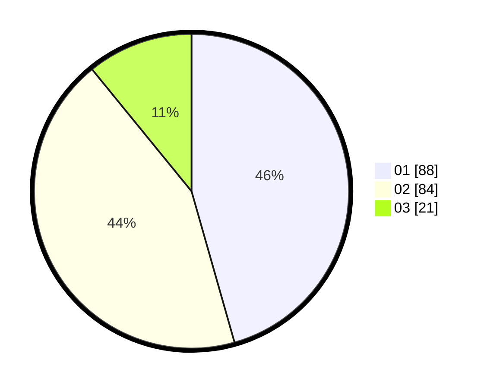

# Hasil

Hasil perolehan suara paslon dapat dilihat pada file paslon-01.txt, paslon-02.txt, dan paslon-03.txt.

Jika tidak ada, artinya data tersebut belum ada pada SIREKAP.

## Perolehan Suara

 * Paslon 01: **88**.
 * Paslon 02: **84**.
 * Paslon 03: **21**.

## Foto C Plano

https://sirekap-obj-formc.kpu.go.id/cce9/pemilu/ppwp/31/73/08/10/03/3173081003018-20240214-222904--7440f695-0321-47f2-9b96-964d2f2e6351.jpg

https://sirekap-obj-formc.kpu.go.id/cce9/pemilu/ppwp/31/73/08/10/03/3173081003018-20240214-223013--edaf785d-2993-4b24-93ae-a2821bac2cef.jpg

https://sirekap-obj-formc.kpu.go.id/cce9/pemilu/ppwp/31/73/08/10/03/3173081003018-20240214-223303--a012efd0-f0c3-4a86-b1e6-d90cfc97ae3b.jpg
