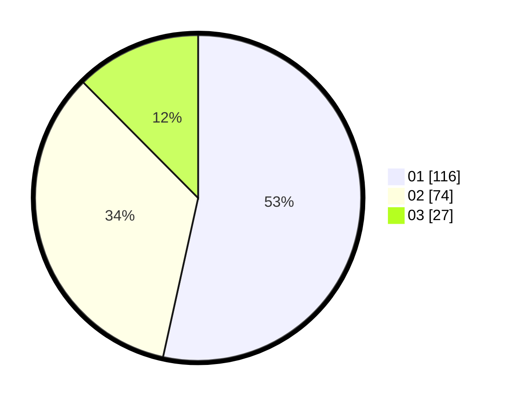

# Hasil

Hasil perolehan suara paslon dapat dilihat pada file paslon-01.txt, paslon-02.txt, dan paslon-03.txt.

Jika tidak ada, artinya data tersebut belum ada pada SIREKAP.

## Perolehan Suara

 * Paslon 01: **116**.
 * Paslon 02: **74**.
 * Paslon 03: **27**.

## Foto C Plano

https://sirekap-obj-formc.kpu.go.id/5a83/pemilu/ppwp/31/73/08/10/03/3173081003022-20240214-215434--c35ac9ee-7d94-44ce-a182-8a6924103b12.jpg

https://sirekap-obj-formc.kpu.go.id/5a83/pemilu/ppwp/31/73/08/10/03/3173081003022-20240214-215608--189b0026-1087-4a50-9f37-b70e514327e0.jpg

https://sirekap-obj-formc.kpu.go.id/5a83/pemilu/ppwp/31/73/08/10/03/3173081003022-20240214-215737--f947c023-b5bc-4183-8e2b-682dd0277377.jpg
