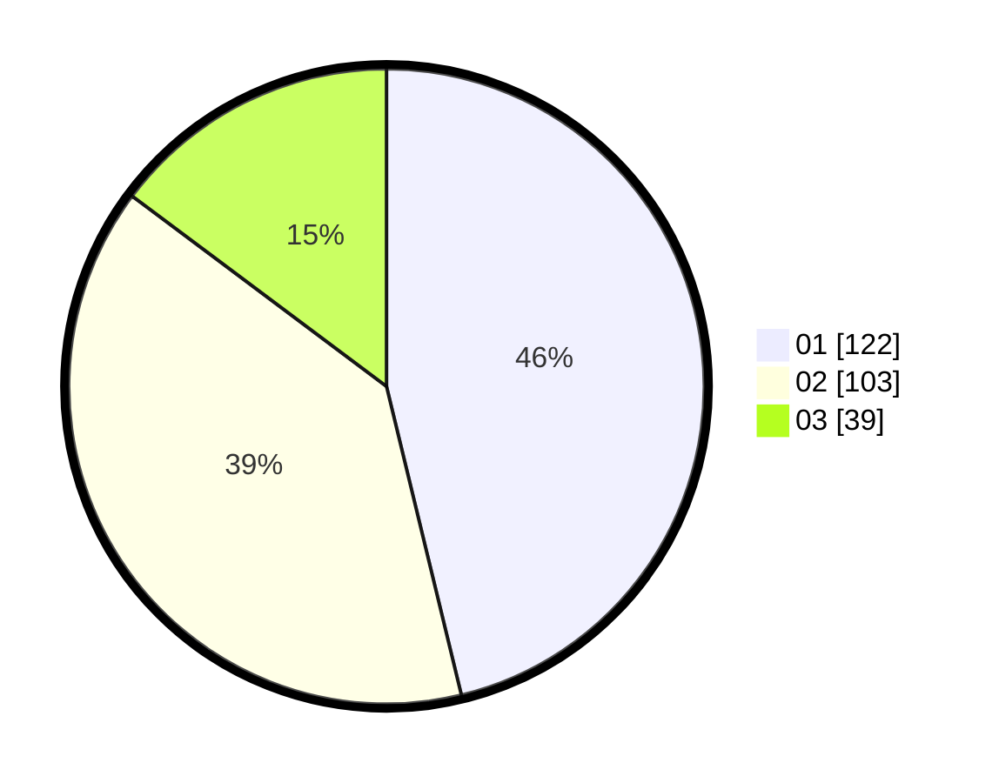

# Hasil

Hasil perolehan suara paslon dapat dilihat pada file paslon-01.txt, paslon-02.txt, dan paslon-03.txt.

Jika tidak ada, artinya data tersebut belum ada pada SIREKAP.

## Perolehan Suara

 * Paslon 01: **122**.
 * Paslon 02: **103**.
 * Paslon 03: **39**.

## Foto C Plano

https://sirekap-obj-formc.kpu.go.id/e16c/pemilu/ppwp/31/73/08/10/03/3173081003026-20240214-192312--3f6e4f6e-3ce9-452f-ad0f-48a801d473a1.jpg

https://sirekap-obj-formc.kpu.go.id/e16c/pemilu/ppwp/31/73/08/10/03/3173081003026-20240214-192337--a453ddb8-cf05-40de-aa34-3fa27a533c3e.jpg
