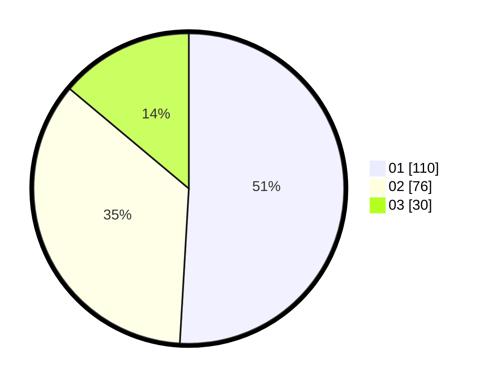

# Hasil

Hasil perolehan suara paslon dapat dilihat pada file paslon-01.txt, paslon-02.txt, dan paslon-03.txt.

Jika tidak ada, artinya data tersebut belum ada pada SIREKAP.

## Perolehan Suara

 * Paslon 01: **110**.
 * Paslon 02: **76**.
 * Paslon 03: **30**.

## Foto C Plano

https://sirekap-obj-formc.kpu.go.id/8a3f/pemilu/ppwp/31/73/08/10/03/3173081003033-20240214-230818--2870a25f-0fff-4512-b6a9-1988a91c0ef6.jpg

https://sirekap-obj-formc.kpu.go.id/8a3f/pemilu/ppwp/31/73/08/10/03/3173081003033-20240214-230837--fc4c1ad0-1221-4408-b6be-1c19b7bc5b64.jpg

https://sirekap-obj-formc.kpu.go.id/8a3f/pemilu/ppwp/31/73/08/10/03/3173081003033-20240214-230854--b0540f00-9d98-4feb-aabc-d9e4f851fc01.jpg
