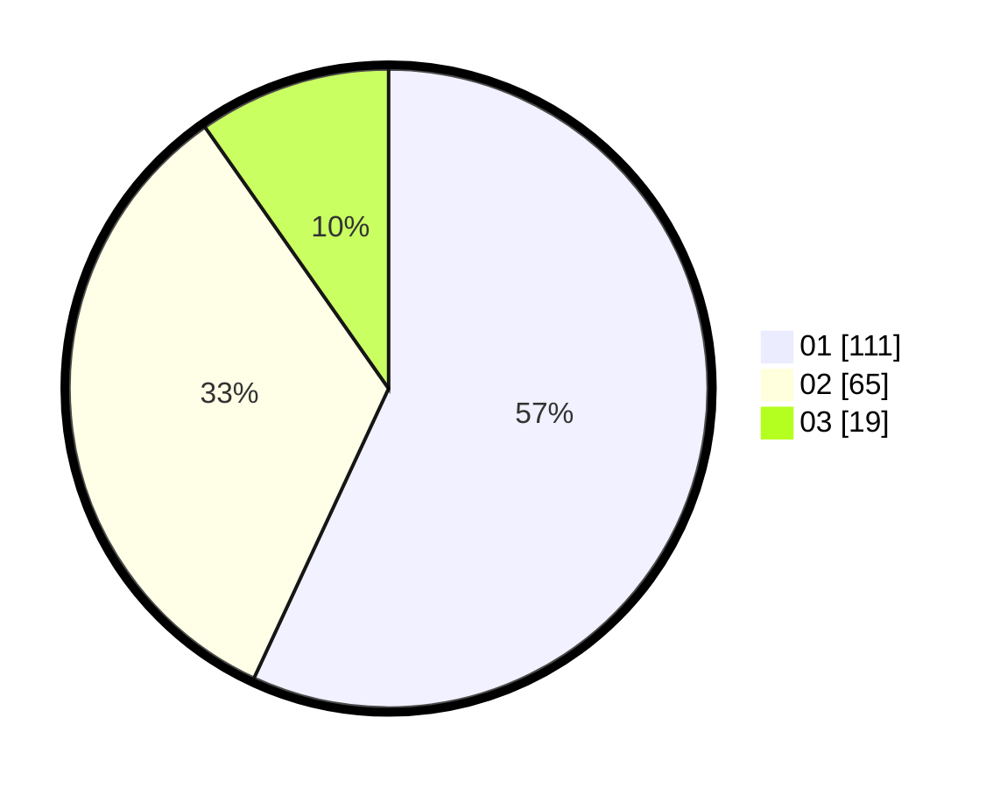

# Hasil

Hasil perolehan suara paslon dapat dilihat pada file paslon-01.txt, paslon-02.txt, dan paslon-03.txt.

Jika tidak ada, artinya data tersebut belum ada pada SIREKAP.

## Perolehan Suara

 * Paslon 01: **111**.
 * Paslon 02: **65**.
 * Paslon 03: **19**.

## Foto C Plano

https://sirekap-obj-formc.kpu.go.id/1803/pemilu/ppwp/31/73/08/10/03/3173081003034-20240216-044752--c479e875-cfab-4ca3-af48-0c3a4eb0f2b3.jpg

https://sirekap-obj-formc.kpu.go.id/1803/pemilu/ppwp/31/73/08/10/03/3173081003034-20240216-044757--83442ff6-0a57-4c44-a387-e7441f3483ad.jpg

https://sirekap-obj-formc.kpu.go.id/1803/pemilu/ppwp/31/73/08/10/03/3173081003034-20240216-044753--0ac0b69b-dd16-44d7-a4bc-bf8eba45f32a.jpg

## DATA PEMILIH TETAP

Jumlah pemilih dalam DPT: **250**.
 * L: **113**.
 * P: **137**.

## DATA PENGGUNA HAK PILIH

Jumlah pengguna hak pilih dalam DPT: **198**.
 * L: **84**.
 * P: **114**.

Jumlah pengguna hak pilih dalam DPTb: **1**.
 * L: **1**.
 * P: **0**.

Jumlah pengguna hak pilih dalam DPK: **0**.
 * L: **0**.
 * P: **0**.

Jumlah pengguna hak pilih: **199**.
 * L: **85**.
 * P: **114**.

## JUMLAH SUARA SAH DAN TIDAK SAH

JUMLAH SELURUH SUARA SAH: **195**.

JUMLAH SUARA TIDAK SAH: **4**.

JUMLAH SELURUH SUARA SAH DAN SUARA TIDAK SAH: **199**.
