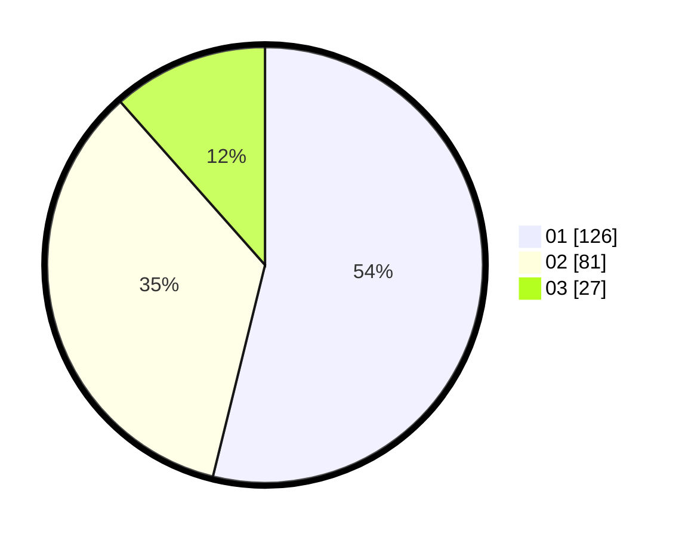

# Hasil

Hasil perolehan suara paslon dapat dilihat pada file paslon-01.txt, paslon-02.txt, dan paslon-03.txt.

Jika tidak ada, artinya data tersebut belum ada pada SIREKAP.

## Perolehan Suara

 * Paslon 01: **126**.
 * Paslon 02: **81**.
 * Paslon 03: **27**.

## Foto C Plano

https://sirekap-obj-formc.kpu.go.id/46d7/pemilu/ppwp/31/73/08/10/03/3173081003036-20240215-051449--85804009-69cb-46ee-8308-924e0687b296.jpg

https://sirekap-obj-formc.kpu.go.id/46d7/pemilu/ppwp/31/73/08/10/03/3173081003036-20240215-024110--fedcfa45-a133-4208-b66a-8e8ff566831d.jpg
