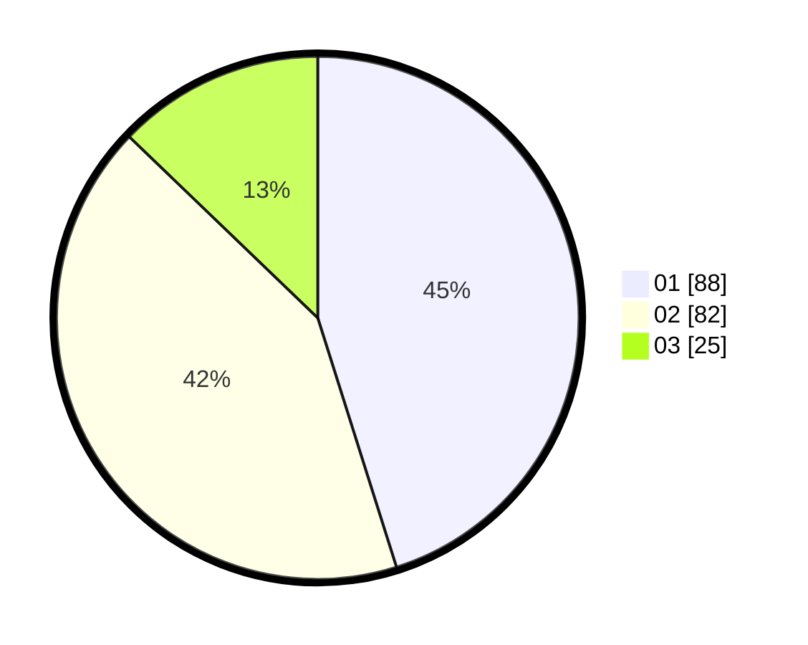

# Hasil

Hasil perolehan suara paslon dapat dilihat pada file paslon-01.txt, paslon-02.txt, dan paslon-03.txt.

Jika tidak ada, artinya data tersebut belum ada pada SIREKAP.

## Perolehan Suara

 * Paslon 01: **88**.
 * Paslon 02: **82**.
 * Paslon 03: **25**.

## Foto C Plano

https://sirekap-obj-formc.kpu.go.id/56dd/pemilu/ppwp/31/73/08/10/03/3173081003040-20240214-190353--1dfdf9f5-7851-468b-ad76-9f6c4f31bdd4.jpg

https://sirekap-obj-formc.kpu.go.id/56dd/pemilu/ppwp/31/73/08/10/03/3173081003040-20240214-185710--576d56dc-e03e-4a88-9ae2-6cc9d4f50866.jpg
