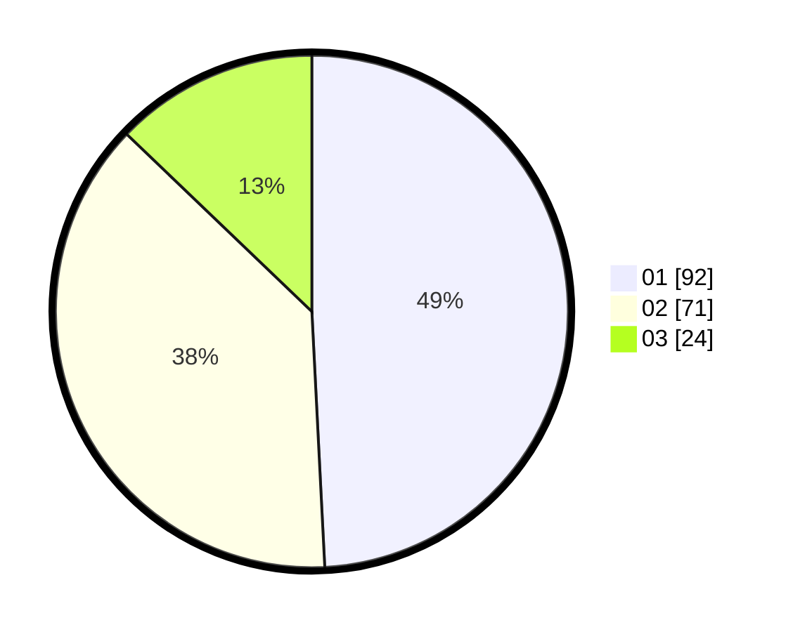

# Hasil

Hasil perolehan suara paslon dapat dilihat pada file paslon-01.txt, paslon-02.txt, dan paslon-03.txt.

Jika tidak ada, artinya data tersebut belum ada pada SIREKAP.

## Perolehan Suara

 * Paslon 01: **92**.
 * Paslon 02: **71**.
 * Paslon 03: **24**.

## Foto C Plano

https://sirekap-obj-formc.kpu.go.id/7d43/pemilu/ppwp/31/73/08/10/03/3173081003041-20240214-215811--d74db299-1b4e-4e10-9e3b-1013e0f42fa7.jpg

https://sirekap-obj-formc.kpu.go.id/7d43/pemilu/ppwp/31/73/08/10/03/3173081003041-20240214-220302--2dd1d6fe-3c62-4605-9d40-0c8f590b16a4.jpg

https://sirekap-obj-formc.kpu.go.id/7d43/pemilu/ppwp/31/73/08/10/03/3173081003041-20240214-220035--f3fc8993-d101-4532-9591-eaf71c84e539.jpg
