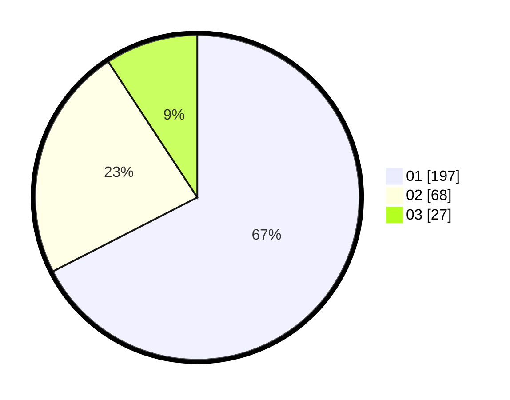

# Hasil

Hasil perolehan suara paslon dapat dilihat pada file paslon-01.txt, paslon-02.txt, dan paslon-03.txt.

Jika tidak ada, artinya data tersebut belum ada pada SIREKAP.

## Perolehan Suara

 * Paslon 01: **197**.
 * Paslon 02: **68**.
 * Paslon 03: **27**.

## Foto C Plano

https://sirekap-obj-formc.kpu.go.id/6dd3/pemilu/ppwp/31/73/08/10/03/3173081003044-20240214-214824--c1592eb2-8926-4ce6-9dc9-7ff12eba4b40.jpg

https://sirekap-obj-formc.kpu.go.id/6dd3/pemilu/ppwp/31/73/08/10/03/3173081003044-20240214-214937--64b2a787-5541-42c0-9e11-744def40cc47.jpg

https://sirekap-obj-formc.kpu.go.id/6dd3/pemilu/ppwp/31/73/08/10/03/3173081003044-20240214-210641--9141958b-1a09-4969-9338-2b7b928bee67.jpg
