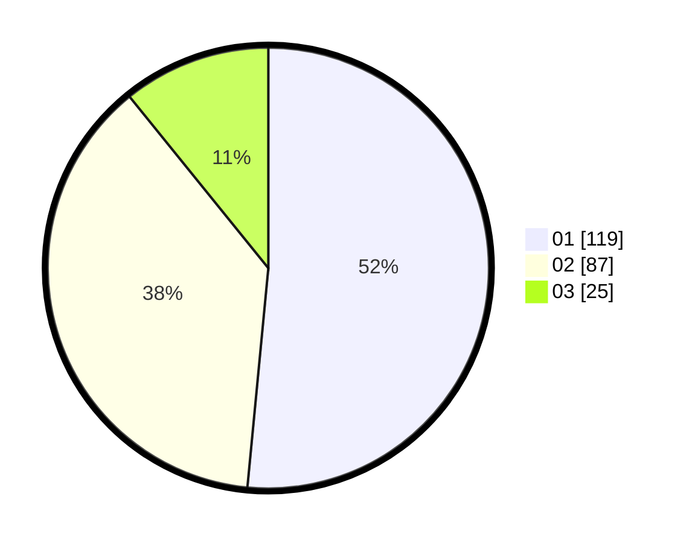

# Hasil

Hasil perolehan suara paslon dapat dilihat pada file paslon-01.txt, paslon-02.txt, dan paslon-03.txt.

Jika tidak ada, artinya data tersebut belum ada pada SIREKAP.

## Perolehan Suara

 * Paslon 01: **119**.
 * Paslon 02: **87**.
 * Paslon 03: **25**.

## Foto C Plano

https://sirekap-obj-formc.kpu.go.id/0b18/pemilu/ppwp/31/73/08/10/03/3173081003049-20240214-225418--8f69482c-d47f-41fc-a0dd-04acff808d95.jpg

https://sirekap-obj-formc.kpu.go.id/0b18/pemilu/ppwp/31/73/08/10/03/3173081003049-20240214-225645--0f13b790-b781-42ce-8e8b-940bb04446ff.jpg

https://sirekap-obj-formc.kpu.go.id/0b18/pemilu/ppwp/31/73/08/10/03/3173081003049-20240214-221145--369bb4cd-45d4-4992-b213-122f1fe87cf2.jpg
