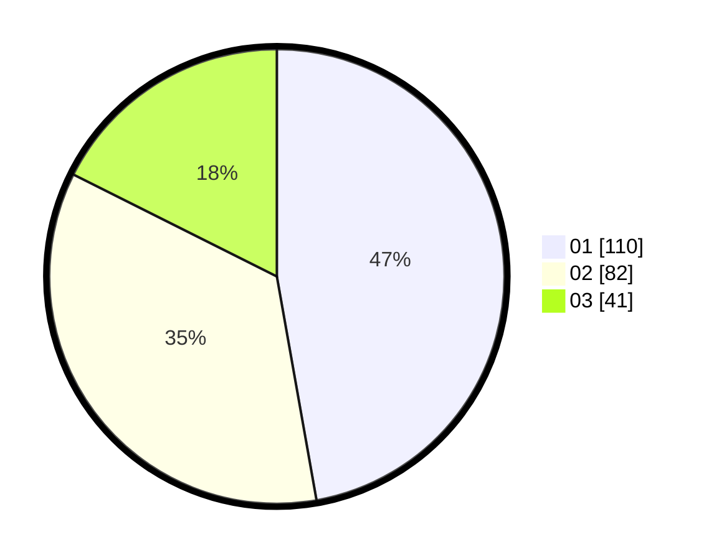

# Hasil

Hasil perolehan suara paslon dapat dilihat pada file paslon-01.txt, paslon-02.txt, dan paslon-03.txt.

Jika tidak ada, artinya data tersebut belum ada pada SIREKAP.

## Perolehan Suara

 * Paslon 01: **110**.
 * Paslon 02: **82**.
 * Paslon 03: **41**.

## Foto C Plano

https://sirekap-obj-formc.kpu.go.id/5e0f/pemilu/ppwp/31/73/08/10/03/3173081003050-20240214-211440--1e9b1144-db63-4787-a0e1-588db00002a4.jpg

https://sirekap-obj-formc.kpu.go.id/5e0f/pemilu/ppwp/31/73/08/10/03/3173081003050-20240214-212131--ca567f8a-81ea-446a-861f-c0cabf846fe9.jpg

https://sirekap-obj-formc.kpu.go.id/5e0f/pemilu/ppwp/31/73/08/10/03/3173081003050-20240214-212208--a50be4bd-a379-4bd5-ba48-b7520de0580c.jpg
