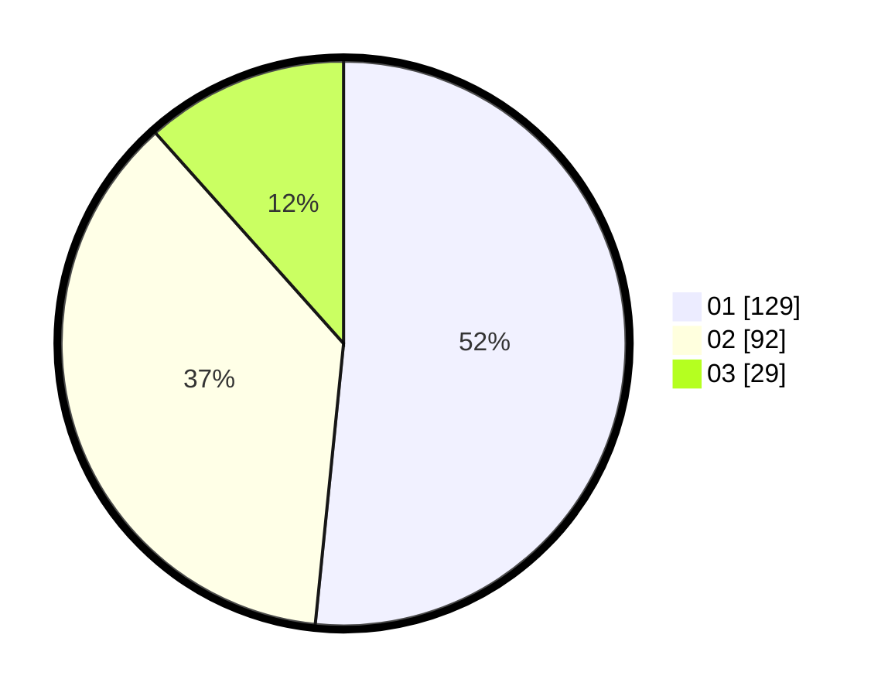

# Hasil

Hasil perolehan suara paslon dapat dilihat pada file paslon-01.txt, paslon-02.txt, dan paslon-03.txt.

Jika tidak ada, artinya data tersebut belum ada pada SIREKAP.

## Perolehan Suara

 * Paslon 01: **129**.
 * Paslon 02: **92**.
 * Paslon 03: **29**.

## Foto C Plano

https://sirekap-obj-formc.kpu.go.id/1022/pemilu/ppwp/31/73/08/10/03/3173081003052-20240214-234926--7a5a4b4f-c8f9-4514-a385-d5be7efb69b6.jpg

https://sirekap-obj-formc.kpu.go.id/1022/pemilu/ppwp/31/73/08/10/03/3173081003052-20240214-234455--b41a0f50-d6b9-46ad-b993-4bf9186b26d7.jpg

https://sirekap-obj-formc.kpu.go.id/1022/pemilu/ppwp/31/73/08/10/03/3173081003052-20240214-234656--a2154431-2033-48d0-b9ab-7f1a45ba6349.jpg

## DATA PEMILIH TETAP

Jumlah pemilih dalam DPT: **297**.
 * L: **142**.
 * P: **155**.

## DATA PENGGUNA HAK PILIH

Jumlah pengguna hak pilih dalam DPT: **250**.
 * L: **120**.
 * P: **130**.

Jumlah pengguna hak pilih dalam DPTb: **3**.
 * L: **1**.
 * P: **2**.

Jumlah pengguna hak pilih dalam DPK: **2**.
 * L: **1**.
 * P: **1**.

Jumlah pengguna hak pilih: **255**.
 * L: **122**.
 * P: **133**.

## JUMLAH SUARA SAH DAN TIDAK SAH

JUMLAH SELURUH SUARA SAH: **250**.

JUMLAH SUARA TIDAK SAH: **5**.

JUMLAH SELURUH SUARA SAH DAN SUARA TIDAK SAH: **255**.
