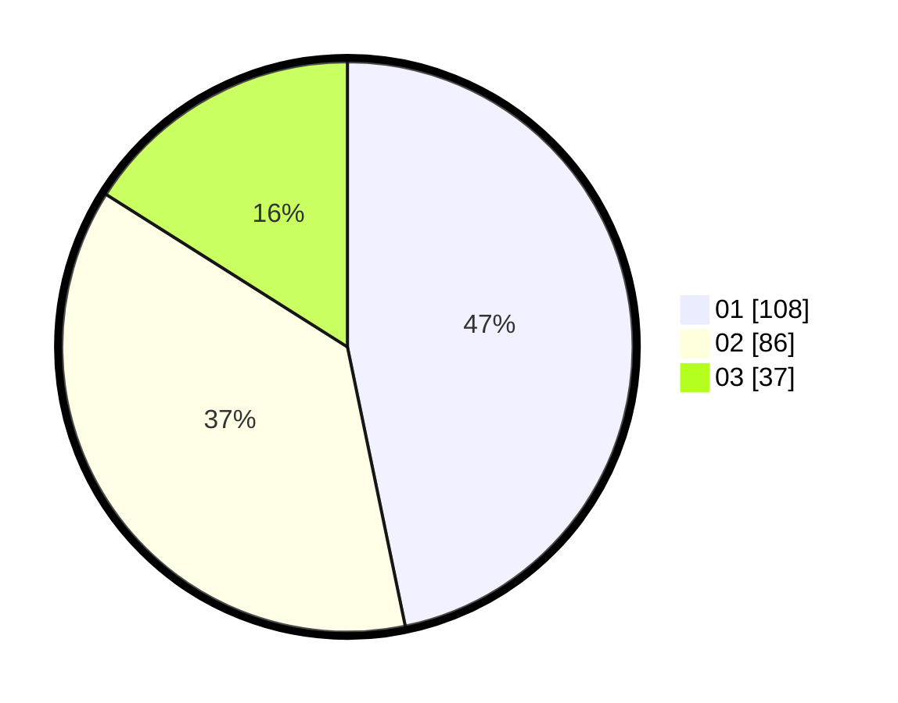

# Hasil

Hasil perolehan suara paslon dapat dilihat pada file paslon-01.txt, paslon-02.txt, dan paslon-03.txt.

Jika tidak ada, artinya data tersebut belum ada pada SIREKAP.

## Perolehan Suara

 * Paslon 01: **108**.
 * Paslon 02: **86**.
 * Paslon 03: **37**.

## Foto C Plano

https://sirekap-obj-formc.kpu.go.id/2630/pemilu/ppwp/31/73/08/10/03/3173081003054-20240214-224743--d24798c8-81b0-47d3-87b6-835dfa918973.jpg

https://sirekap-obj-formc.kpu.go.id/2630/pemilu/ppwp/31/73/08/10/03/3173081003054-20240214-224828--fc244b83-74c0-4ff3-9001-828e9b2055a6.jpg

https://sirekap-obj-formc.kpu.go.id/2630/pemilu/ppwp/31/73/08/10/03/3173081003054-20240214-225006--33dc6db7-4ee3-4cf3-a8c6-2308e479a492.jpg
