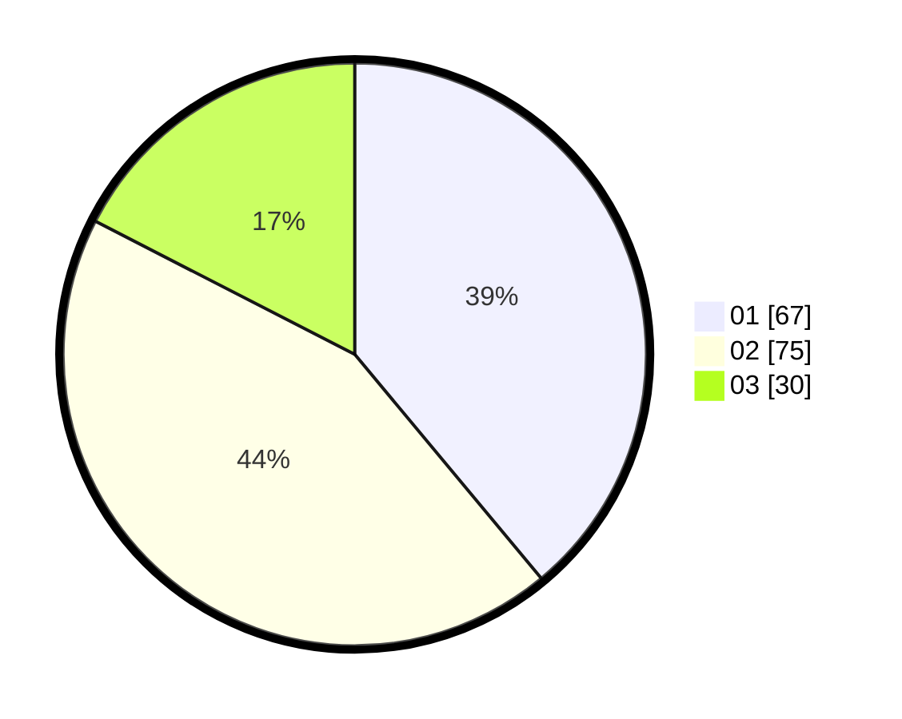

# Hasil

Hasil perolehan suara paslon dapat dilihat pada file paslon-01.txt, paslon-02.txt, dan paslon-03.txt.

Jika tidak ada, artinya data tersebut belum ada pada SIREKAP.

## Perolehan Suara

 * Paslon 01: **67**.
 * Paslon 02: **75**.
 * Paslon 03: **30**.

## Foto C Plano

https://sirekap-obj-formc.kpu.go.id/4ed6/pemilu/ppwp/31/73/08/10/03/3173081003061-20240214-190033--4f47243c-61b4-476b-aae3-7e22458519b7.jpg

https://sirekap-obj-formc.kpu.go.id/4ed6/pemilu/ppwp/31/73/08/10/03/3173081003061-20240214-175445--fb2e6d34-7875-4984-bfc0-7bc10c467f51.jpg

https://sirekap-obj-formc.kpu.go.id/4ed6/pemilu/ppwp/31/73/08/10/03/3173081003061-20240216-031929--3f353e66-4193-4664-9198-ddf53da1f6bd.jpg

## DATA PEMILIH TETAP

Jumlah pemilih dalam DPT: **225**.
 * L: **123**.
 * P: **102**.

## DATA PENGGUNA HAK PILIH

Jumlah pengguna hak pilih dalam DPT: **180**.
 * L: **96**.
 * P: **84**.

Jumlah pengguna hak pilih dalam DPTb: **0**.
 * L: **0**.
 * P: **0**.

Jumlah pengguna hak pilih dalam DPK: **0**.
 * L: **0**.
 * P: **0**.

Jumlah pengguna hak pilih: **180**.
 * L: **96**.
 * P: **84**.

## JUMLAH SUARA SAH DAN TIDAK SAH

JUMLAH SELURUH SUARA SAH: **172**.

JUMLAH SUARA TIDAK SAH: **8**.

JUMLAH SELURUH SUARA SAH DAN SUARA TIDAK SAH: **180**.
