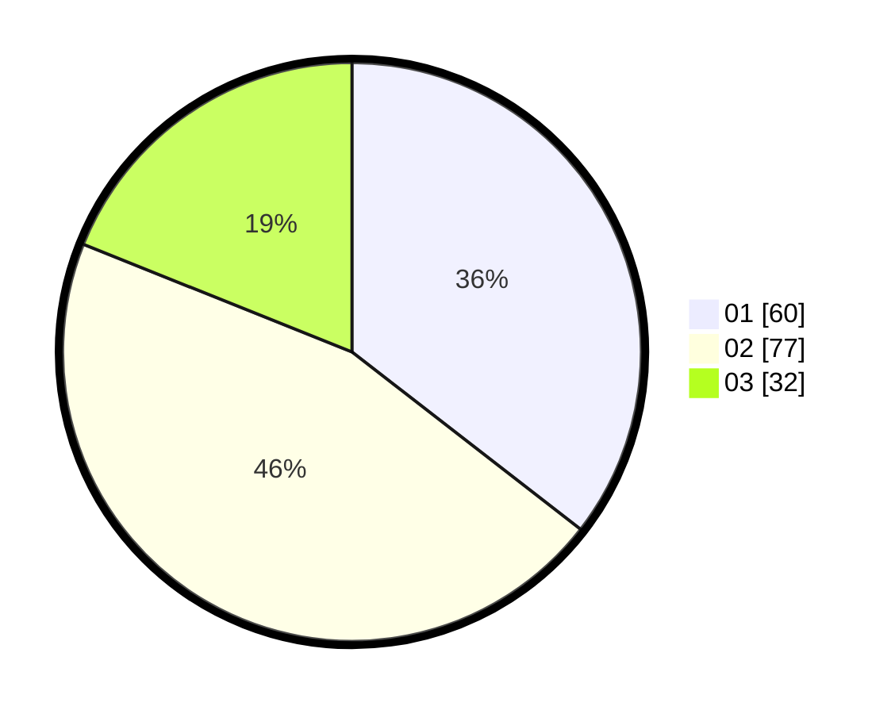

# Hasil

Hasil perolehan suara paslon dapat dilihat pada file paslon-01.txt, paslon-02.txt, dan paslon-03.txt.

Jika tidak ada, artinya data tersebut belum ada pada SIREKAP.

## Perolehan Suara

 * Paslon 01: **60**.
 * Paslon 02: **77**.
 * Paslon 03: **32**.

## Foto C Plano

https://sirekap-obj-formc.kpu.go.id/1c87/pemilu/ppwp/31/73/08/10/03/3173081003062-20240214-201945--cbc2ee2d-6784-48c3-8b47-35e783ba1ccb.jpg

https://sirekap-obj-formc.kpu.go.id/1c87/pemilu/ppwp/31/73/08/10/03/3173081003062-20240214-203635--e04277b7-f77c-414c-a679-57d1b0a7caa9.jpg

https://sirekap-obj-formc.kpu.go.id/1c87/pemilu/ppwp/31/73/08/10/03/3173081003062-20240214-203735--fec24b4d-47f9-437d-9cca-bb458c69c929.jpg
