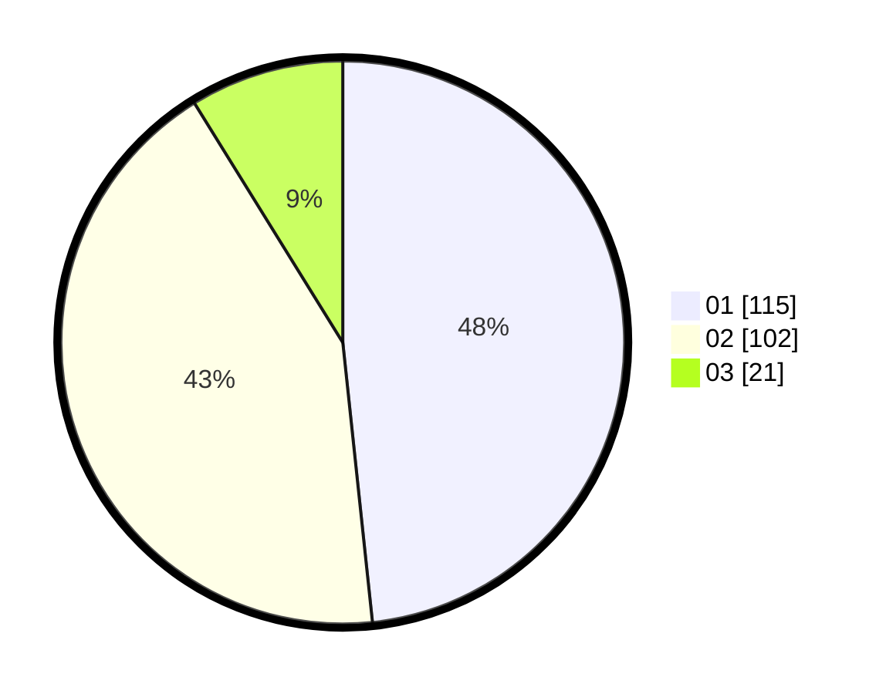

# Hasil

Hasil perolehan suara paslon dapat dilihat pada file paslon-01.txt, paslon-02.txt, dan paslon-03.txt.

Jika tidak ada, artinya data tersebut belum ada pada SIREKAP.

## Perolehan Suara

 * Paslon 01: **115**.
 * Paslon 02: **102**.
 * Paslon 03: **21**.

## Foto C Plano

https://sirekap-obj-formc.kpu.go.id/8c49/pemilu/ppwp/31/73/08/10/03/3173081003075-20240214-194815--4c8462b3-a853-4fa6-ad0a-bbefeae32a62.jpg

https://sirekap-obj-formc.kpu.go.id/8c49/pemilu/ppwp/31/73/08/10/03/3173081003075-20240214-195047--0b01d747-7e0c-40eb-adae-4fd980455598.jpg

https://sirekap-obj-formc.kpu.go.id/8c49/pemilu/ppwp/31/73/08/10/03/3173081003075-20240214-195251--013227e5-735a-4875-bb4e-42ccc8675813.jpg

## DATA PEMILIH TETAP

Jumlah pemilih dalam DPT: **299**.
 * L: **146**.
 * P: **153**.

## DATA PENGGUNA HAK PILIH

Jumlah pengguna hak pilih dalam DPT: **238**.
 * L: **170**.
 * P: **68**.

Jumlah pengguna hak pilih dalam DPTb: **3**.
 * L: **3**.
 * P: **0**.

Jumlah pengguna hak pilih dalam DPK: **2**.
 * L: **1**.
 * P: **1**.

Jumlah pengguna hak pilih: **243**.
 * L: **174**.
 * P: **69**.

## JUMLAH SUARA SAH DAN TIDAK SAH

JUMLAH SELURUH SUARA SAH: **238**.

JUMLAH SUARA TIDAK SAH: **7**.

JUMLAH SELURUH SUARA SAH DAN SUARA TIDAK SAH: **245**.
