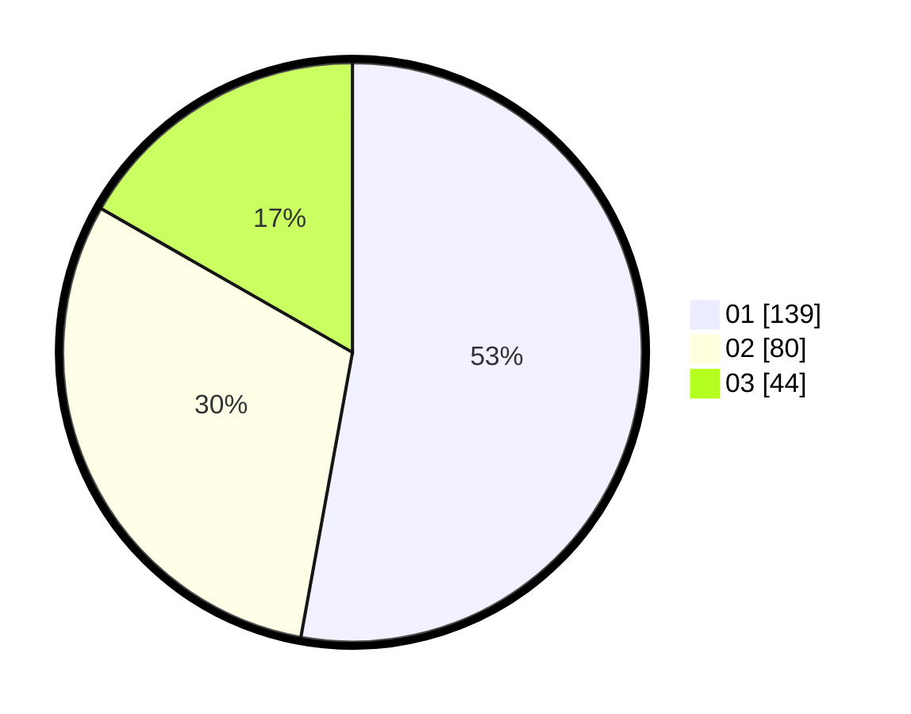

# Hasil

Hasil perolehan suara paslon dapat dilihat pada file paslon-01.txt, paslon-02.txt, dan paslon-03.txt.

Jika tidak ada, artinya data tersebut belum ada pada SIREKAP.

## Perolehan Suara

 * Paslon 01: **139**.
 * Paslon 02: **80**.
 * Paslon 03: **44**.

## Foto C Plano

https://sirekap-obj-formc.kpu.go.id/edd1/pemilu/ppwp/31/73/08/10/03/3173081003076-20240215-212734--ab1990a4-cdf0-4411-b87a-b9e7f694f743.jpg

https://sirekap-obj-formc.kpu.go.id/edd1/pemilu/ppwp/31/73/08/10/03/3173081003076-20240214-234543--74743bc0-4be1-4a40-8e3d-e6002d9acc53.jpg

https://sirekap-obj-formc.kpu.go.id/edd1/pemilu/ppwp/31/73/08/10/03/3173081003076-20240214-235058--5bc8421a-b50f-4d00-9816-bcef4d074b0a.jpg
