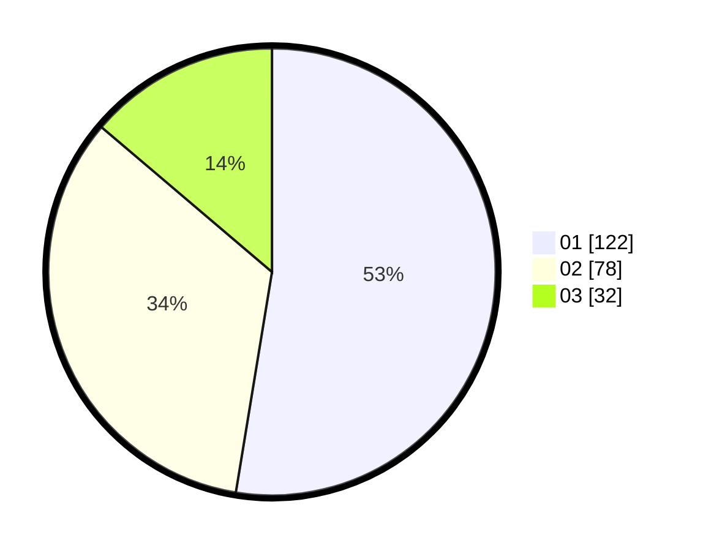

# Hasil

Hasil perolehan suara paslon dapat dilihat pada file paslon-01.txt, paslon-02.txt, dan paslon-03.txt.

Jika tidak ada, artinya data tersebut belum ada pada SIREKAP.

## Perolehan Suara

 * Paslon 01: **122**.
 * Paslon 02: **78**.
 * Paslon 03: **32**.

## Foto C Plano

https://sirekap-obj-formc.kpu.go.id/f88c/pemilu/ppwp/31/73/08/10/03/3173081003086-20240216-220239--52641739-3ec4-41aa-822f-5a668b4230af.jpg

https://sirekap-obj-formc.kpu.go.id/f88c/pemilu/ppwp/31/73/08/10/03/3173081003086-20240216-220240--ace7719d-2472-4e1e-9096-be0388301855.jpg

https://sirekap-obj-formc.kpu.go.id/f88c/pemilu/ppwp/31/73/08/10/03/3173081003086-20240216-220240--b473e29d-194f-4cf1-9dbc-bcf5f92c5b6d.jpg

## DATA PEMILIH TETAP

Jumlah pemilih dalam DPT: **289**.
 * L: **149**.
 * P: **140**.

## DATA PENGGUNA HAK PILIH

Jumlah pengguna hak pilih dalam DPT: **237**.
 * L: **123**.
 * P: **114**.

Jumlah pengguna hak pilih dalam DPTb: **0**.
 * L: **0**.
 * P: **0**.

Jumlah pengguna hak pilih dalam DPK: **0**.
 * L: **0**.
 * P: **0**.

Jumlah pengguna hak pilih: **237**.
 * L: **123**.
 * P: **114**.

## JUMLAH SUARA SAH DAN TIDAK SAH

JUMLAH SELURUH SUARA SAH: **232**.

JUMLAH SUARA TIDAK SAH: **5**.

JUMLAH SELURUH SUARA SAH DAN SUARA TIDAK SAH: **237**.
