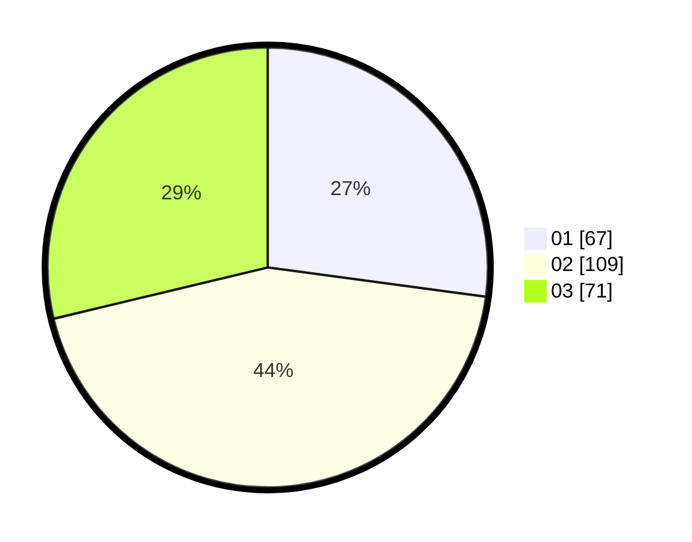

# Hasil

Hasil perolehan suara paslon dapat dilihat pada file paslon-01.txt, paslon-02.txt, dan paslon-03.txt.

Jika tidak ada, artinya data tersebut belum ada pada SIREKAP.

## Perolehan Suara

 * Paslon 01: **67**.
 * Paslon 02: **109**.
 * Paslon 03: **71**.

## Foto C Plano

https://sirekap-obj-formc.kpu.go.id/be25/pemilu/ppwp/31/73/08/10/03/3173081003087-20240215-000417--4206b6be-4be4-4d71-bc91-cc653e9cb79e.jpg

https://sirekap-obj-formc.kpu.go.id/be25/pemilu/ppwp/31/73/08/10/03/3173081003087-20240215-001051--80be479b-fdaa-4ea7-9d1a-40948f3c00af.jpg

https://sirekap-obj-formc.kpu.go.id/be25/pemilu/ppwp/31/73/08/10/03/3173081003087-20240215-001446--e6993019-84d5-49d6-b74b-ca4ef9ae2c63.jpg
