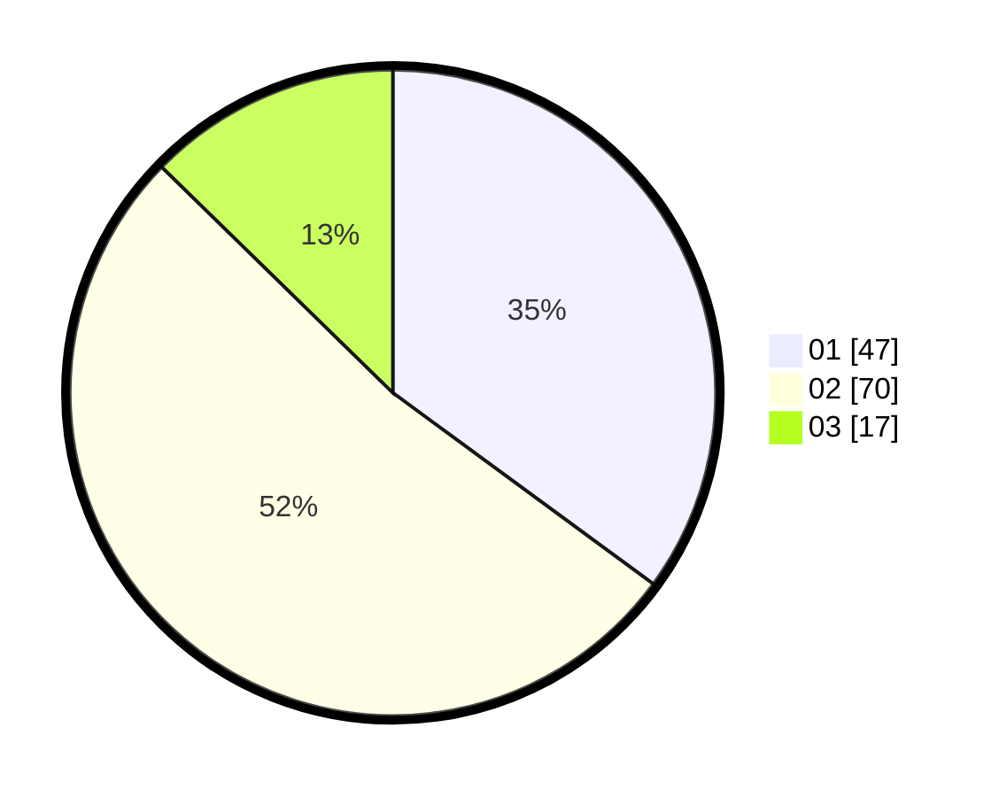

# Hasil

Hasil perolehan suara paslon dapat dilihat pada file paslon-01.txt, paslon-02.txt, dan paslon-03.txt.

Jika tidak ada, artinya data tersebut belum ada pada SIREKAP.

## Perolehan Suara

 * Paslon 01: **47**.
 * Paslon 02: **70**.
 * Paslon 03: **17**.

## Foto C Plano

https://sirekap-obj-formc.kpu.go.id/2d27/pemilu/ppwp/31/73/08/10/03/3173081003089-20240214-221700--541dd2f4-6b3a-4cde-aae1-4c6f402e49ea.jpg

https://sirekap-obj-formc.kpu.go.id/2d27/pemilu/ppwp/31/73/08/10/03/3173081003089-20240214-221757--66b8a4da-f68e-420c-9442-a9d421e67d4c.jpg

https://sirekap-obj-formc.kpu.go.id/2d27/pemilu/ppwp/31/73/08/10/03/3173081003089-20240214-221858--1448f2f6-abce-4026-a511-fa321b59dbb5.jpg
