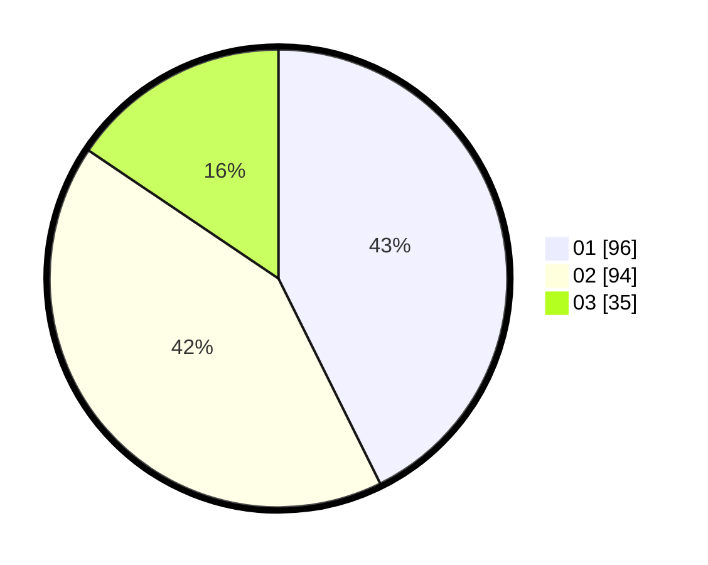

# Hasil

Hasil perolehan suara paslon dapat dilihat pada file paslon-01.txt, paslon-02.txt, dan paslon-03.txt.

Jika tidak ada, artinya data tersebut belum ada pada SIREKAP.

## Perolehan Suara

 * Paslon 01: **96**.
 * Paslon 02: **94**.
 * Paslon 03: **35**.

## Foto C Plano

https://sirekap-obj-formc.kpu.go.id/b074/pemilu/ppwp/31/73/08/10/03/3173081003093-20240214-185145--3fd3369f-6d99-441b-ac00-f006da4c5327.jpg

https://sirekap-obj-formc.kpu.go.id/b074/pemilu/ppwp/31/73/08/10/03/3173081003093-20240214-185106--07431167-2085-4f86-b4ca-9a29540009fb.jpg

https://sirekap-obj-formc.kpu.go.id/b074/pemilu/ppwp/31/73/08/10/03/3173081003093-20240214-185151--f25620b6-9c65-4258-a485-4096cbe1150c.jpg

## DATA PEMILIH TETAP

Jumlah pemilih dalam DPT: **271**.
 * L: **141**.
 * P: **130**.

## DATA PENGGUNA HAK PILIH

Jumlah pengguna hak pilih dalam DPT: **225**.
 * L: **117**.
 * P: **108**.

Jumlah pengguna hak pilih dalam DPTb: **3**.
 * L: **1**.
 * P: **2**.

Jumlah pengguna hak pilih dalam DPK: **5**.
 * L: **2**.
 * P: **3**.

Jumlah pengguna hak pilih: **233**.
 * L: **119**.
 * P: **113**.

## JUMLAH SUARA SAH DAN TIDAK SAH

JUMLAH SELURUH SUARA SAH: **225**.

JUMLAH SUARA TIDAK SAH: **8**.

JUMLAH SELURUH SUARA SAH DAN SUARA TIDAK SAH: **233**.
