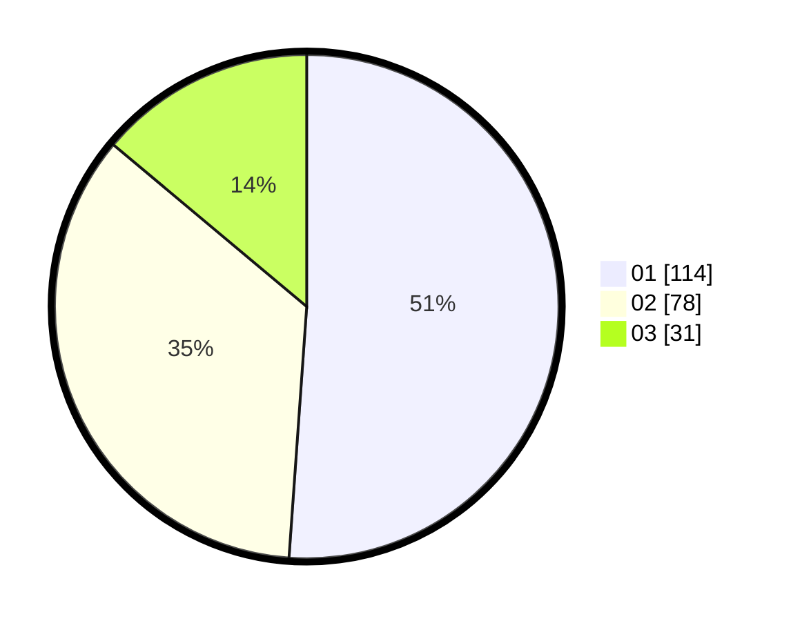

# Hasil

Hasil perolehan suara paslon dapat dilihat pada file paslon-01.txt, paslon-02.txt, dan paslon-03.txt.

Jika tidak ada, artinya data tersebut belum ada pada SIREKAP.

## Perolehan Suara

 * Paslon 01: **114**.
 * Paslon 02: **78**.
 * Paslon 03: **31**.

## Foto C Plano

https://sirekap-obj-formc.kpu.go.id/04f6/pemilu/ppwp/31/73/08/10/03/3173081003098-20240214-232308--51420d42-3f82-4ace-8336-a40c9d183c04.jpg

https://sirekap-obj-formc.kpu.go.id/04f6/pemilu/ppwp/31/73/08/10/03/3173081003098-20240214-232251--27009d45-83bf-40a7-8087-249831e72a0e.jpg
