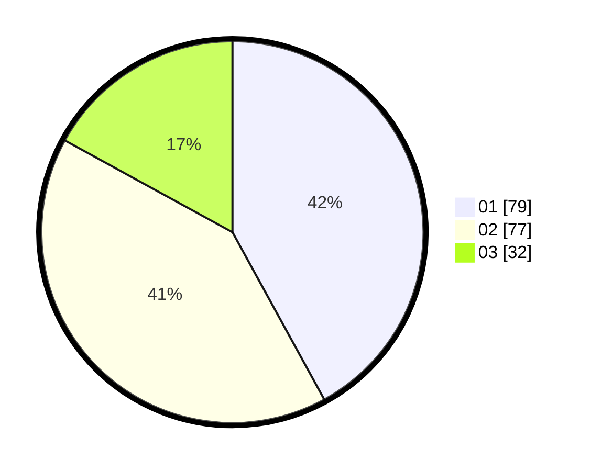

# Hasil

Hasil perolehan suara paslon dapat dilihat pada file paslon-01.txt, paslon-02.txt, dan paslon-03.txt.

Jika tidak ada, artinya data tersebut belum ada pada SIREKAP.

## Perolehan Suara

 * Paslon 01: **79**.
 * Paslon 02: **77**.
 * Paslon 03: **32**.

## Foto C Plano

https://sirekap-obj-formc.kpu.go.id/3e54/pemilu/ppwp/31/73/08/10/03/3173081003101-20240214-155906--3be8e2a1-1c7e-45d8-a700-1f167014a283.jpg

https://sirekap-obj-formc.kpu.go.id/3e54/pemilu/ppwp/31/73/08/10/03/3173081003101-20240214-205954--f755192f-784f-49f5-b2ee-cc3563bdde61.jpg
