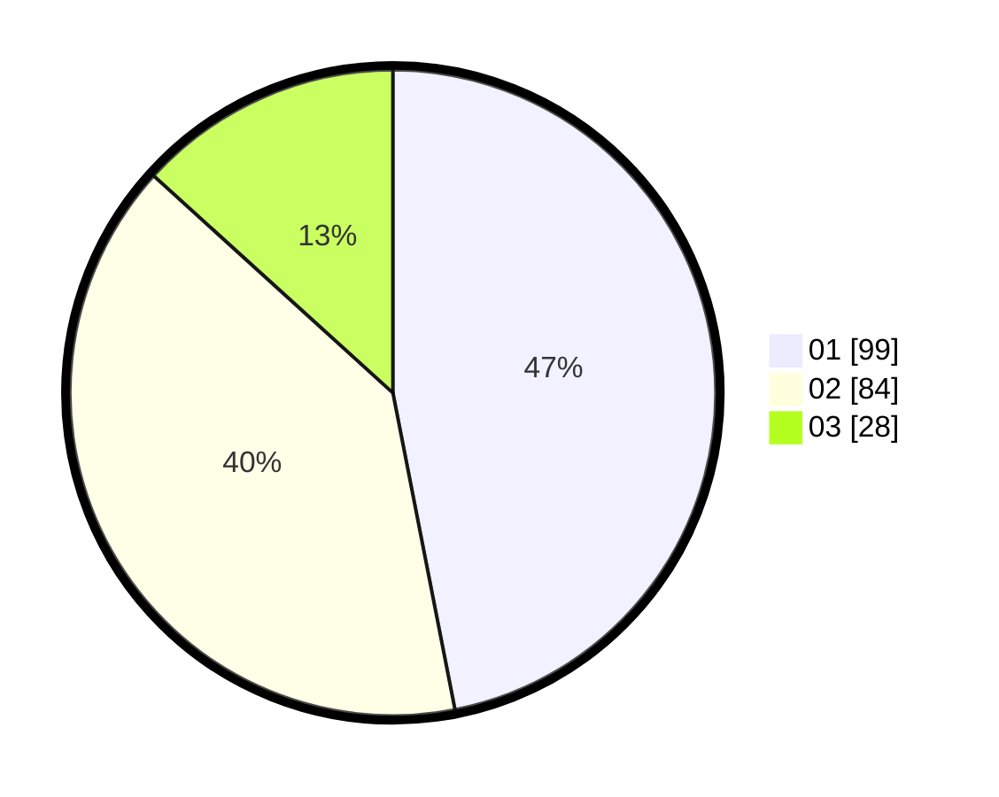

# Hasil

Hasil perolehan suara paslon dapat dilihat pada file paslon-01.txt, paslon-02.txt, dan paslon-03.txt.

Jika tidak ada, artinya data tersebut belum ada pada SIREKAP.

## Perolehan Suara

 * Paslon 01: **99**.
 * Paslon 02: **84**.
 * Paslon 03: **28**.

## Foto C Plano

https://sirekap-obj-formc.kpu.go.id/5820/pemilu/ppwp/31/73/08/10/03/3173081003104-20240214-200052--71293275-ad06-4670-b760-6162a88564c7.jpg

https://sirekap-obj-formc.kpu.go.id/5820/pemilu/ppwp/31/73/08/10/03/3173081003104-20240214-200530--b59621e9-ef4f-4277-a759-e107b7fdb7d2.jpg

https://sirekap-obj-formc.kpu.go.id/5820/pemilu/ppwp/31/73/08/10/03/3173081003104-20240214-195128--daf8cee9-a39c-4c9e-b7f1-65f03eb7c66b.jpg

## DATA PEMILIH TETAP

Jumlah pemilih dalam DPT: **255**.
 * L: **121**.
 * P: **134**.

## DATA PENGGUNA HAK PILIH

Jumlah pengguna hak pilih dalam DPT: **204**.
 * L: **96**.
 * P: **108**.

Jumlah pengguna hak pilih dalam DPTb: **6**.
 * L: **4**.
 * P: **2**.

Jumlah pengguna hak pilih dalam DPK: **4**.
 * L: **2**.
 * P: **2**.

Jumlah pengguna hak pilih: **214**.
 * L: **102**.
 * P: **112**.

## JUMLAH SUARA SAH DAN TIDAK SAH

JUMLAH SELURUH SUARA SAH: **211**.

JUMLAH SUARA TIDAK SAH: **3**.

JUMLAH SELURUH SUARA SAH DAN SUARA TIDAK SAH: **214**.
