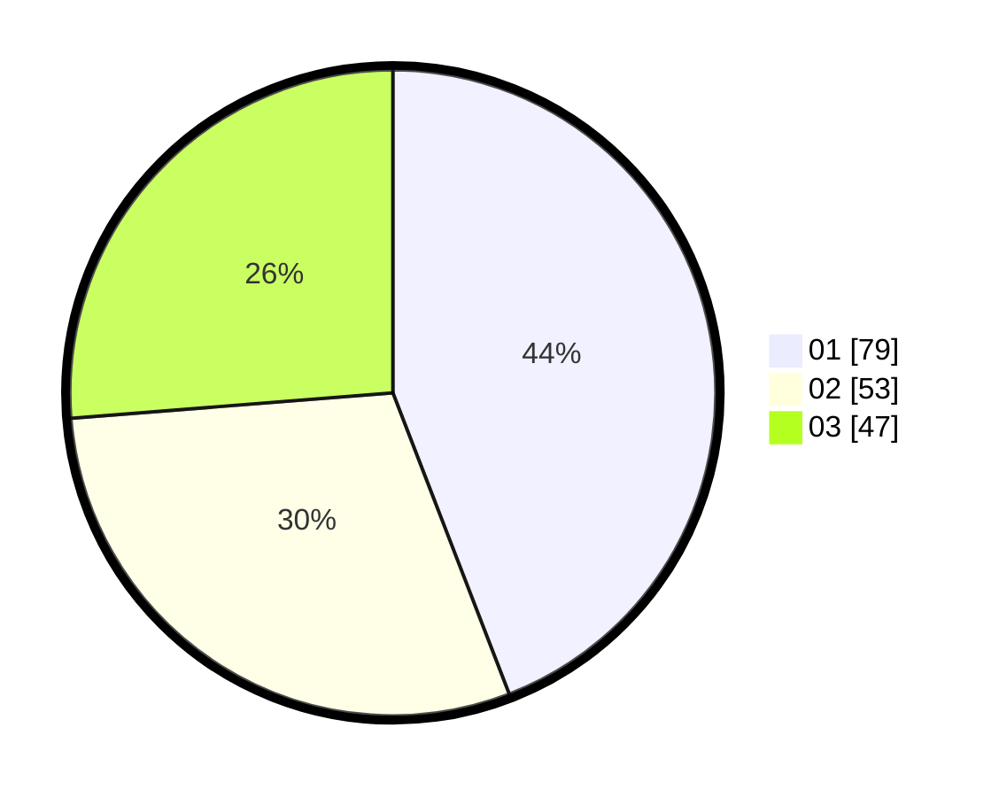

# Hasil

Hasil perolehan suara paslon dapat dilihat pada file paslon-01.txt, paslon-02.txt, dan paslon-03.txt.

Jika tidak ada, artinya data tersebut belum ada pada SIREKAP.

## Perolehan Suara

 * Paslon 01: **79**.
 * Paslon 02: **53**.
 * Paslon 03: **47**.

## Foto C Plano

https://sirekap-obj-formc.kpu.go.id/9329/pemilu/ppwp/31/73/08/10/03/3173081003108-20240214-211305--d19bbecf-4d22-42ea-863f-83b8aea961d0.jpg

https://sirekap-obj-formc.kpu.go.id/9329/pemilu/ppwp/31/73/08/10/03/3173081003108-20240214-223746--f51e1c44-c9a8-491d-9b87-89cc767db51b.jpg

https://sirekap-obj-formc.kpu.go.id/9329/pemilu/ppwp/31/73/08/10/03/3173081003108-20240214-211445--15ae6474-0089-4809-8141-c27fd4eed61f.jpg
