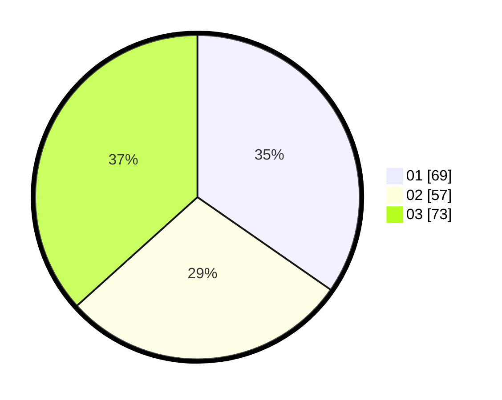

# Hasil

Hasil perolehan suara paslon dapat dilihat pada file paslon-01.txt, paslon-02.txt, dan paslon-03.txt.

Jika tidak ada, artinya data tersebut belum ada pada SIREKAP.

## Perolehan Suara

 * Paslon 01: **69**.
 * Paslon 02: **57**.
 * Paslon 03: **73**.

## Foto C Plano

https://sirekap-obj-formc.kpu.go.id/9e57/pemilu/ppwp/31/73/08/10/03/3173081003110-20240214-232600--e8b0946d-b3ac-4939-9ff5-242900fba679.jpg

https://sirekap-obj-formc.kpu.go.id/9e57/pemilu/ppwp/31/73/08/10/03/3173081003110-20240214-232640--b3e43291-7132-4c6c-8f2a-8a476e002675.jpg

https://sirekap-obj-formc.kpu.go.id/9e57/pemilu/ppwp/31/73/08/10/03/3173081003110-20240215-054315--a1b8d9c1-0886-444a-97bf-c331169dbec7.jpg
