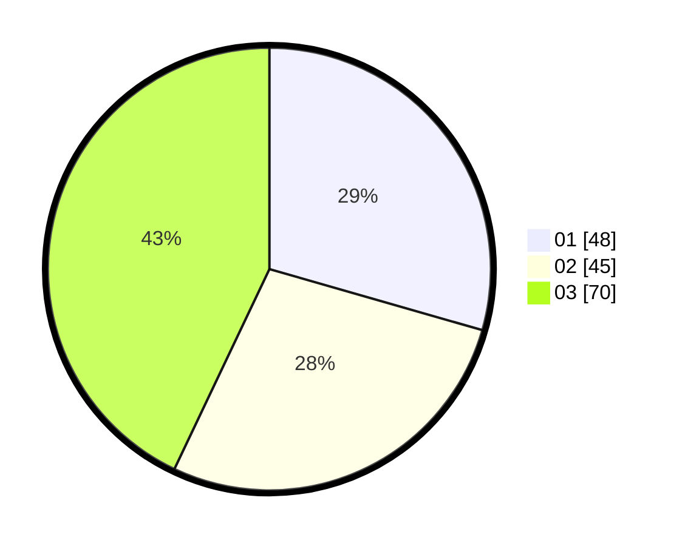

# Hasil

Hasil perolehan suara paslon dapat dilihat pada file paslon-01.txt, paslon-02.txt, dan paslon-03.txt.

Jika tidak ada, artinya data tersebut belum ada pada SIREKAP.

## Perolehan Suara

 * Paslon 01: **48**.
 * Paslon 02: **45**.
 * Paslon 03: **70**.

## Foto C Plano

https://sirekap-obj-formc.kpu.go.id/7f90/pemilu/ppwp/31/73/08/10/03/3173081003111-20240215-010921--270c789f-6145-4540-aaec-9f6a5c46fdc0.jpg

https://sirekap-obj-formc.kpu.go.id/7f90/pemilu/ppwp/31/73/08/10/03/3173081003111-20240215-011025--c14ef20b-1cf1-478e-907a-b71018e08bf0.jpg

https://sirekap-obj-formc.kpu.go.id/7f90/pemilu/ppwp/31/73/08/10/03/3173081003111-20240214-191744--d9403d0a-d853-4a6e-b8d3-1b6a53b7f78a.jpg

## DATA PEMILIH TETAP

Jumlah pemilih dalam DPT: **222**.
 * L: **112**.
 * P: **110**.

## DATA PENGGUNA HAK PILIH

Jumlah pengguna hak pilih dalam DPT: **160**.
 * L: **81**.
 * P: **79**.

Jumlah pengguna hak pilih dalam DPTb: **0**.
 * L: **0**.
 * P: **0**.

Jumlah pengguna hak pilih dalam DPK: **4**.
 * L: **0**.
 * P: **4**.

Jumlah pengguna hak pilih: **164**.
 * L: **81**.
 * P: **83**.

## JUMLAH SUARA SAH DAN TIDAK SAH

JUMLAH SELURUH SUARA SAH: **163**.

JUMLAH SUARA TIDAK SAH: **1**.

JUMLAH SELURUH SUARA SAH DAN SUARA TIDAK SAH: **164**.
