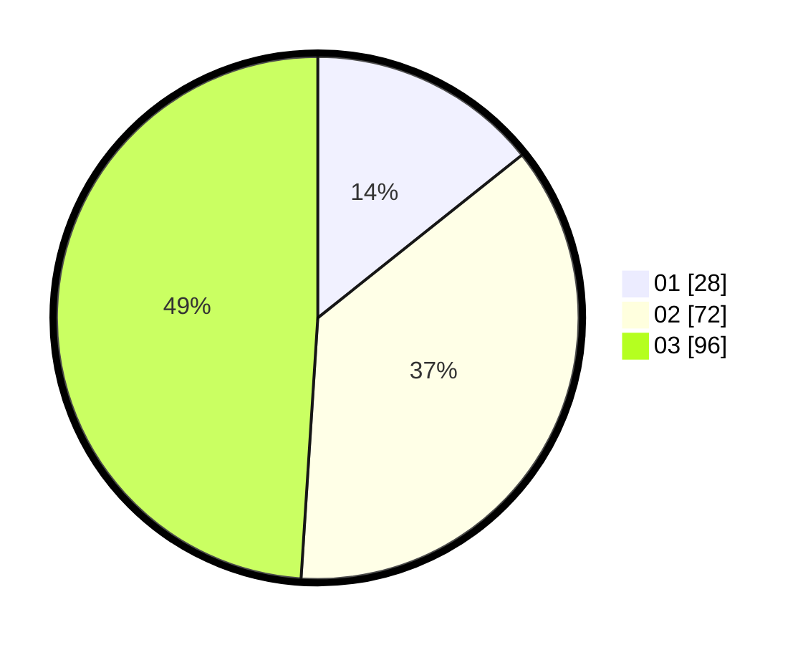

# Hasil

Hasil perolehan suara paslon dapat dilihat pada file paslon-01.txt, paslon-02.txt, dan paslon-03.txt.

Jika tidak ada, artinya data tersebut belum ada pada SIREKAP.

## Perolehan Suara

 * Paslon 01: **28**.
 * Paslon 02: **72**.
 * Paslon 03: **96**.

## Foto C Plano

https://sirekap-obj-formc.kpu.go.id/3a03/pemilu/ppwp/31/73/08/10/03/3173081003113-20240215-073000--5908137e-1b0e-411a-8912-4d101fa74ee7.jpg

https://sirekap-obj-formc.kpu.go.id/3a03/pemilu/ppwp/31/73/08/10/03/3173081003113-20240215-072948--fde7478e-a650-4f83-8ce0-d1a868a68eec.jpg

https://sirekap-obj-formc.kpu.go.id/3a03/pemilu/ppwp/31/73/08/10/03/3173081003113-20240215-070752--1d278907-92d4-4b4e-b2ff-ee682baf2045.jpg
