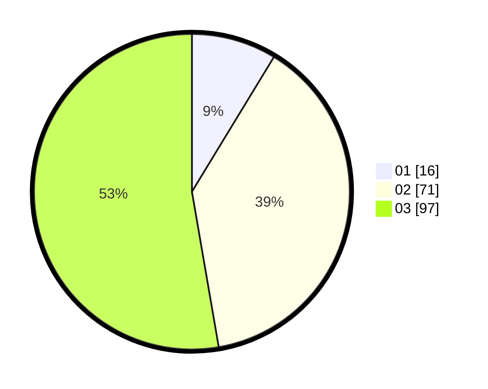

# Hasil

Hasil perolehan suara paslon dapat dilihat pada file paslon-01.txt, paslon-02.txt, dan paslon-03.txt.

Jika tidak ada, artinya data tersebut belum ada pada SIREKAP.

## Perolehan Suara

 * Paslon 01: **16**.
 * Paslon 02: **71**.
 * Paslon 03: **97**.

## Foto C Plano

https://sirekap-obj-formc.kpu.go.id/6b68/pemilu/ppwp/31/73/08/10/03/3173081003115-20240214-221715--d95ade8e-f372-4853-a0ab-e7592a05f155.jpg

https://sirekap-obj-formc.kpu.go.id/6b68/pemilu/ppwp/31/73/08/10/03/3173081003115-20240214-221744--dfffb759-0124-4dab-b425-385df9103bc2.jpg

https://sirekap-obj-formc.kpu.go.id/6b68/pemilu/ppwp/31/73/08/10/03/3173081003115-20240214-221842--7a2517f3-f76e-4aff-a151-a341ee7efc3d.jpg
