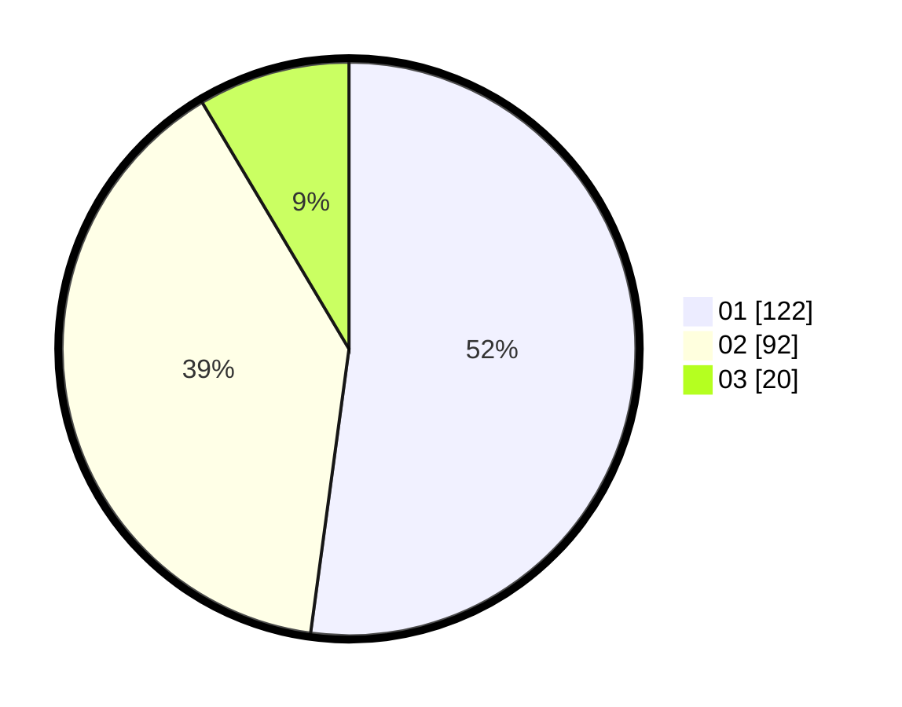

# Hasil

Hasil perolehan suara paslon dapat dilihat pada file paslon-01.txt, paslon-02.txt, dan paslon-03.txt.

Jika tidak ada, artinya data tersebut belum ada pada SIREKAP.

## Perolehan Suara

 * Paslon 01: **122**.
 * Paslon 02: **92**.
 * Paslon 03: **20**.

## Foto C Plano

https://sirekap-obj-formc.kpu.go.id/e801/pemilu/ppwp/31/73/08/10/04/3173081004005-20240214-191014--54c37293-b7f3-494e-9468-6cf96229eeb9.jpg

https://sirekap-obj-formc.kpu.go.id/e801/pemilu/ppwp/31/73/08/10/04/3173081004005-20240214-191113--5823dc21-bd57-4c52-ab27-d176f39b5f2a.jpg

https://sirekap-obj-formc.kpu.go.id/e801/pemilu/ppwp/31/73/08/10/04/3173081004005-20240214-191211--3ca79c24-0192-4b4b-b43c-6f230d52ddd6.jpg
