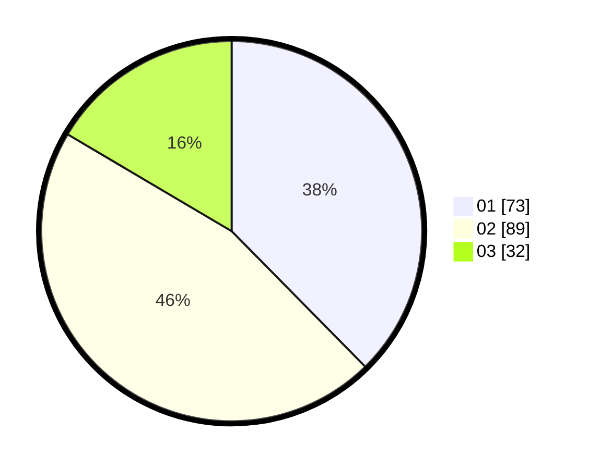

# Hasil

Hasil perolehan suara paslon dapat dilihat pada file paslon-01.txt, paslon-02.txt, dan paslon-03.txt.

Jika tidak ada, artinya data tersebut belum ada pada SIREKAP.

## Perolehan Suara

 * Paslon 01: **73**.
 * Paslon 02: **89**.
 * Paslon 03: **32**.

## Foto C Plano

https://sirekap-obj-formc.kpu.go.id/c03c/pemilu/ppwp/31/73/08/10/04/3173081004009-20240214-221813--664acb34-3cad-49de-a9aa-20edc5a8e626.jpg

https://sirekap-obj-formc.kpu.go.id/c03c/pemilu/ppwp/31/73/08/10/04/3173081004009-20240214-221900--c0886075-d951-4f38-950c-d6a2f1a1547c.jpg

https://sirekap-obj-formc.kpu.go.id/c03c/pemilu/ppwp/31/73/08/10/04/3173081004009-20240214-221948--5ca0e1ad-1817-4500-ae68-7777d56647d1.jpg

## DATA PEMILIH TETAP

Jumlah pemilih dalam DPT: **251**.
 * L: **115**.
 * P: **136**.

## DATA PENGGUNA HAK PILIH

Jumlah pengguna hak pilih dalam DPT: **190**.
 * L: **83**.
 * P: **107**.

Jumlah pengguna hak pilih dalam DPTb: **4**.
 * L: **1**.
 * P: **3**.

Jumlah pengguna hak pilih dalam DPK: **3**.
 * L: **0**.
 * P: **3**.

Jumlah pengguna hak pilih: **197**.
 * L: **84**.
 * P: **113**.

## JUMLAH SUARA SAH DAN TIDAK SAH

JUMLAH SELURUH SUARA SAH: **194**.

JUMLAH SUARA TIDAK SAH: **3**.

JUMLAH SELURUH SUARA SAH DAN SUARA TIDAK SAH: **197**.
