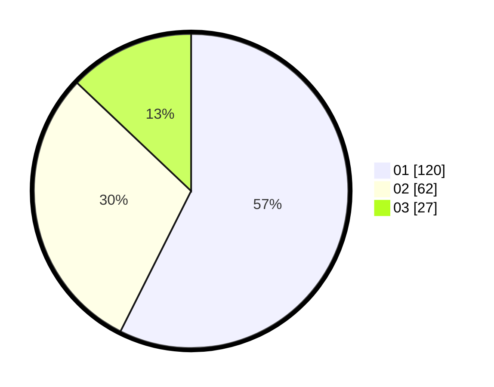

# Hasil

Hasil perolehan suara paslon dapat dilihat pada file paslon-01.txt, paslon-02.txt, dan paslon-03.txt.

Jika tidak ada, artinya data tersebut belum ada pada SIREKAP.

## Perolehan Suara

 * Paslon 01: **120**.
 * Paslon 02: **62**.
 * Paslon 03: **27**.

## Foto C Plano

https://sirekap-obj-formc.kpu.go.id/a4cd/pemilu/ppwp/31/73/08/10/04/3173081004011-20240214-155750--14c3a4fc-e06d-4e7c-9d2e-6505773173ba.jpg

https://sirekap-obj-formc.kpu.go.id/a4cd/pemilu/ppwp/31/73/08/10/04/3173081004011-20240214-155909--a54013fa-2df3-47d2-858c-191b96156e62.jpg

https://sirekap-obj-formc.kpu.go.id/a4cd/pemilu/ppwp/31/73/08/10/04/3173081004011-20240214-160102--2452cc36-91a9-4142-88c7-a211db563659.jpg

## DATA PEMILIH TETAP

Jumlah pemilih dalam DPT: **294**.
 * L: **139**.
 * P: **155**.

## DATA PENGGUNA HAK PILIH

Jumlah pengguna hak pilih dalam DPT: **211**.
 * L: **97**.
 * P: **114**.

Jumlah pengguna hak pilih dalam DPTb: **0**.
 * L: **0**.
 * P: **0**.

Jumlah pengguna hak pilih dalam DPK: **2**.
 * L: **0**.
 * P: **2**.

Jumlah pengguna hak pilih: **213**.
 * L: **97**.
 * P: **116**.

## JUMLAH SUARA SAH DAN TIDAK SAH

JUMLAH SELURUH SUARA SAH: **209**.

JUMLAH SUARA TIDAK SAH: **4**.

JUMLAH SELURUH SUARA SAH DAN SUARA TIDAK SAH: **213**.
